# Haarat

## Johdanto

Jos halutaan kehittää samasta ohjelmistosta useita rinnakkaisia versioita yhtaikaa, tarvitaan versiopuuhun __haara__ (_branch_)

Haarautumista tarvitaan esim., kun
- Kehitetään tuotteen seuraavaa versiota samaan aikaan, kun nykyiseen tehdään korjauksia
- Tehdään asiakaskohtaisia korjauksia tai räätälöintejä
- Moni kehittäjä kehittää samaa ohjelmistoa yhtaikaa.

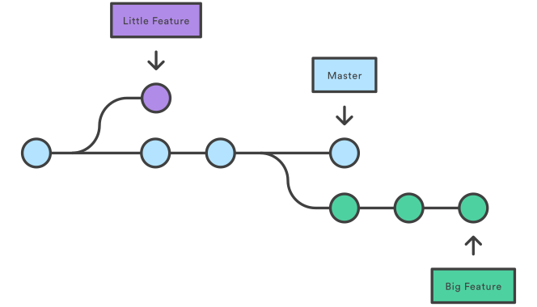

_Lähde: [Git Branch, Atlassian](https://www.atlassian.com/git/tutorials/using-branches)_

Jokaisessa mainituista tapauksista halutaan tehdä yhtaikaisesti kehitystä kahteen tai useampaan versioon ohjelmistosta. Monen kehittäjän tapauksessa jokainen kehittäjä luo omaa versiotaan ohjelmistosta. 

Versionhallintajärjestelmän keinoin haarautuneet versiot ohjelmistosta voidaan jälleen __yhdistää__ (_merge_). Esimerkiksi, kehittäjä yhdistää oman kehityshaaransa muutokset yhteiseen versiohaaraan, josta toiset kehittäjät saavat sen käyttöönsä ja edelleen kehitettäväksi.

## Miten Git toimii

Haarautumisen ymmärtämiseksi on syytä perehtyä muutamiin Git:n toimintaperiaatteisiin.

__Talletus__ (_commit_) tallettaa 
1. viittaukset niihin tiedostoversioihin, jotka olet sinne lisännyt (_snapshot_), sekä 
2. viittauksen edelliseen talletukseen. 
 
Muutoksia voi siis navigoida taaksepäin seuraamalla viittauksia.

__Haara__ (_branch_) on viittaus talletukseen, josta tulee aikanaan seuraavan talletuksen edeltäjä. Kun teet uuden talletuksen, haaraviittaus siirtyy eteenpäin osoittamaan tekemääsi uutta talletusta. 

Haara siis antaa nimen tiettyyn talletusketjuun, ja haaraviittauksen avulla löydetään sen tuorein talletus.

__HEAD__ on viittaus siihen haaraan, jossa tällä hetkellä olet. Se on looginen tunniste, ei haara. 

Jokin haara on aina valittuna, HEAD viittaa aina johonkin haaraan.

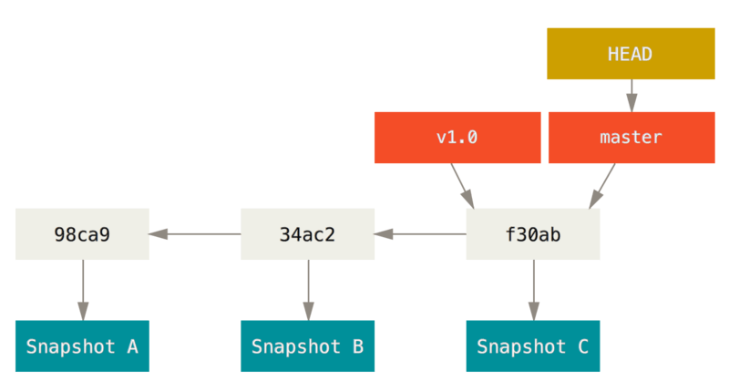


_Lähde: [Chacon S., Straub B, Pro Git, luku 3.](https://git-scm.com/book/en/v2/Git-Branching-Branches-in-a-Nutshell) [CC BY-NC-SA 3.0](https://creativecommons.org/licenses/by-nc-sa/3.0/)_

## Uuden haaran luominen

Kun perustat repositoryn, sinulle on jo valmiiksi luotu yksi haara nimeltä `master`, ja `HEAD` viittaa siihen. Se on Git:n oletushaara. 

Joka kerta, kun teet talletuksen, `master`-viittaus siirtyy eteenpäin siihen, jonka juuri teit.

Voit luoda haaran komennolla `branch`.

```bash
git branch testing
```

Tämä luo uuden haaran, joka osoittaa samaan talletukseen kuin nykyinen haarasikin. Tällä hetkellä haarojen välillä ei ole mitään eroa.

Huomaa, että `HEAD` ei siirry! Olet edelleen `master`-haarassa.

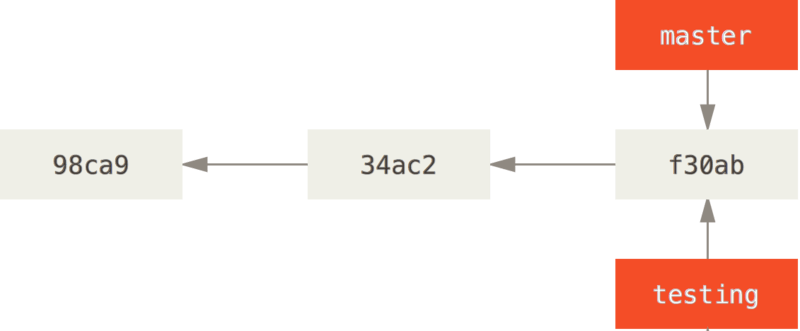

_Lähde: [Chacon S., Straub B, Pro Git, luku 3.](https://git-scm.com/book/en/v2/Git-Branching-Branches-in-a-Nutshell) [CC BY-NC-SA 3.0](https://creativecommons.org/licenses/by-nc-sa/3.0/)_

## Haaran vaihtaminen 

Näet nykyisen haarasi komennolla `status`
```bash
git status
```

Näet olemassa olevat haarat komennolla `branch`
```bash
git branch
```

Haaran voit vaihtaa komennolla `switch`
```bash
git switch testing
```

Nyt `HEAD` osoittaa uuteen `testing`-haaraan, ja seuraava talletus tulee menemään siihen.

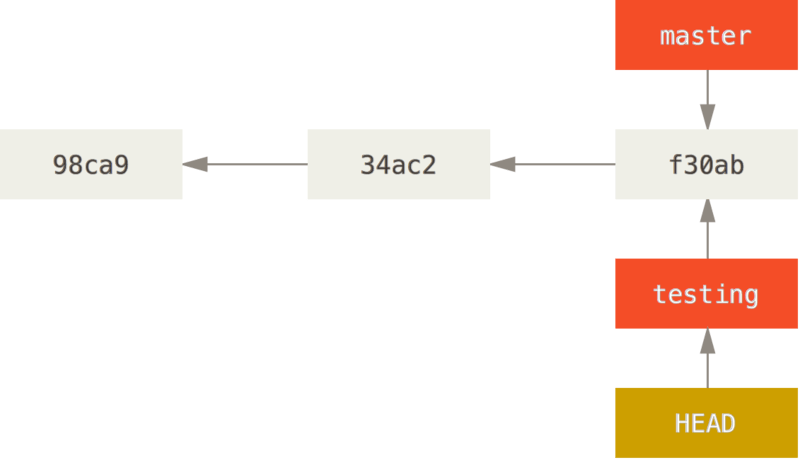

_Lähde: [Chacon S., Straub B, Pro Git, luku 3.](https://git-scm.com/book/en/v2/Git-Branching-Branches-in-a-Nutshell) [CC BY-NC-SA 3.0](https://creativecommons.org/licenses/by-nc-sa/3.0/)_

## Haarauttaminen

Toistaiseksi ei ole vielä tehty mitään muutoksia, mutta tehdäänpä nyt yksi talletus (nykyinen haara on siis `testing`).

`testing`-haara siirtyy nyt yhden talletuksen eteenpäin, mutta `master` jää ennalleen.

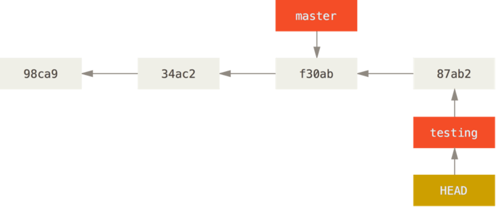

_Lähde: [Chacon S., Straub B, Pro Git, luku 3.](https://git-scm.com/book/en/v2/Git-Branching-Branches-in-a-Nutshell) [CC BY-NC-SA 3.0](https://creativecommons.org/licenses/by-nc-sa/3.0/)_

Jos nyt vaihdat takaisin master-haaraan,
- `HEAD` siirtyy osoittamaan `master`-haaraa ja  
- työhakemiston tiedostot muutetaan takaisin master-haaran tilanteeseen.


_Lähde: [Chacon S., Straub B, Pro Git, luku 3.](https://git-scm.com/book/en/v2/Git-Branching-Branches-in-a-Nutshell) [CC BY-NC-SA 3.0](https://creativecommons.org/licenses/by-nc-sa/3.0/)_

Haaroissa `master` ja `testing` on nyt erilaiset versiot. 

Vaihtamalla haaraa voit  tarkastella niitä, kehittää niitä eteenpäin ja tehdä niistä uusia versioita toisistaan riippumatta.  

Eri haaroihin tehdyt muutokset pysyvät erillisinä, ja voit milloin tahansa palata lähtötilanteeseen, jos tulet katumapäälle. Toiseen haaraan tekemäsi muutokset jäävät silti talteen, ja voit jatkaa niidenkin kehittämistä. 

## Eriytyneet haarat

Jos esimerkissämme nyt teet uuden talletuksen `master`-haaraan, projektilla on kaksi toisistaan erkaantunutta haaraa. Erkaantunut tarkoittaa sitä, että molemmissa haaroissa on talletuksia, joita toisessa ei ole. 

Molempia voidaan kehittää eteenpäin toisistaan riippumatta täysin hallitusti. 

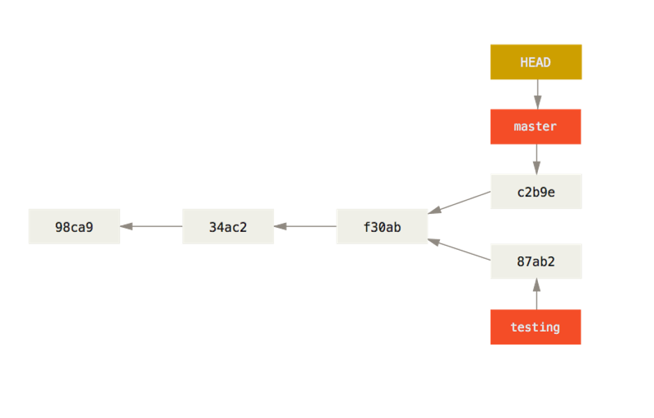

_Lähde: [Chacon S., Straub B, Pro Git, luku 3.](https://git-scm.com/book/en/v2/Git-Branching-Branches-in-a-Nutshell) [CC BY-NC-SA 3.0](https://creativecommons.org/licenses/by-nc-sa/3.0/)_

Nyt commit-lokin esittäminen käy vähän hankalammaksi, kun on esitettävä rinnakkain eteneviä historiapolkuja, esim näin:
```bash
git log --graph --all --oneline
```

Haaroittumisen visualisoinnissa graafiset työkalut voisivat olla paikallaan, esim. GitGUI

> Materiaalissa pitäisi ehkä olla jokin vinkki hyvistä työkaluista

## Yhdistäminen (_merge_)
Haaroihin eriytynyt kehitys halutaan usein jälleen yhdistää, esim. haarassa tehty korjaus halutaan viedä pääkehityshaaraan. 

Seuraavassa esimerkissä pääkehityshaara on `master` ja haaraan `iss53` on tehty vikakorjausta. Vikakorjaus on nyt valmis ja se halutaan viedä pääkehityshaaraan.

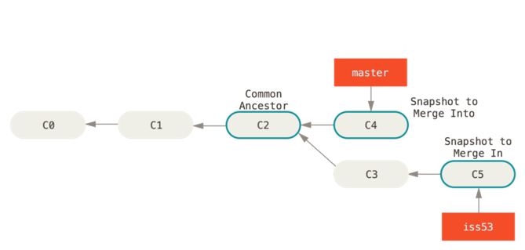

_Lähde: [Chacon S., Straub B, Pro Git, luku 3.](https://git-scm.com/book/en/v2/Git-Branching-Branches-in-a-Nutshell) [CC BY-NC-SA 3.0](https://creativecommons.org/licenses/by-nc-sa/3.0/)_

Yhdistämisen logiikka on, että haaraan, johon yhdistetään, tehdään uusi talletus, joka sisältää molempien haarojen muutokset.

Tässä esimerkissä on kehitetty korjausta haarassa `iss53`. Sen yhdistäminen `master`-haaraan käy näin:
```bash
git switch master   # siirrytään siihen haaraan, johon muutos halutaan yhdistää
git merge iss53     # yhdistäminen tehdään komennolla merge
```
Toiminto merge tekee uuden talletuksen, jossa on yhdistetty molempien haarojen muutokset. Jos muutokset ovat automaattisesti yhdistettävissä, asia on kerralla selvä. 

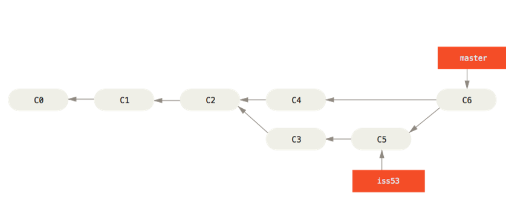

_Lähde: [Chacon S., Straub B, Pro Git, luku 3.](https://git-scm.com/book/en/v2/Git-Branching-Branches-in-a-Nutshell) [CC BY-NC-SA 3.0](https://creativecommons.org/licenses/by-nc-sa/3.0/)_

## Konflikti (_merge conflict_)

Jos eri haarojen muutokset ovat joltain osin keskenään ristiriitaisia, yhdistäminen ei onnistukaan suoraan, vaan Git raportoi __konfliktin__.

Tällöin talletus jää kesken, ja hakemistossa on konfliktin sisältävistä tiedostoista uudet versiot, joissa Git on yhdistänyt kaiken sen, mitä se automaattisesti kykeni. Git on merkinnyt ja lisännyt ristiriitakohtiin molempien haarojen muutokset. 

Konflikti kuulostaa pahalta, mutta kyse on vain siitä, että ei ole mahdollista koneellisesti päättää, mikä on oikea tapa yhdistää muutokset. Kehittäjän on korjattava käsin ristiriitaiset kohdat (_resolve conflict_). Kun se on tehty, hän tekee normaalisti commitin.

Koodieditoreissa on toiminnallisuuksia, jotka auttavat konfliktien ratkaisemisessa.

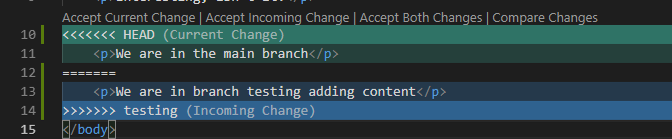

## Esimerkki konfliktista

```
$ git merge testing
Auto-merging hello.html
CONFLICT (content): Merge conflict in hello.html
Automatic merge failed; fix conflicts and then commit the result.
```
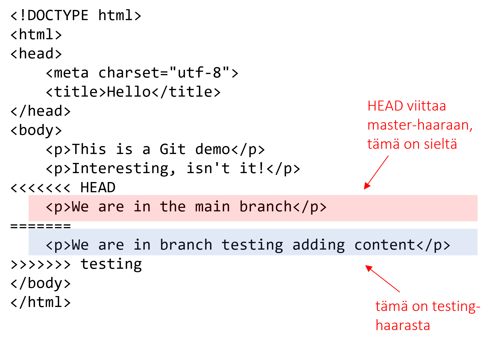

```
$ git status
On branch master
You have unmerged paths.
  (fix conflicts and run "git commit``")
  (use "git merge --abort" to abort the merge)

Unmerged paths:
  (use "git add <file>..." to mark resolution)

        both modified:   hello.html

no changes added to commit (use "git add" and/or "git commit -a")
```
## Konfliktin ratkaiseminen

Kehittäjä tekee oikeat korjaukset ja poistaa konfliktimerkit tiedostoista. Sitten vain lisätään korjatut tiedostot committiin ja tehdään commit.

```
$ git add .	
$ git status
On branch master
All conflicts fixed but you are still merging.
  (use "git commit" to conclude merge)

Changes to be committed:

        modified:   hello.html

$ git commit
[master 577421e] Merge branch 'testing'
```
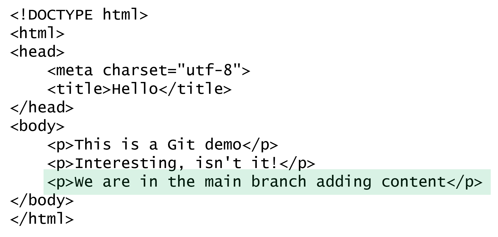


## Haarautumisen käyttötapoja

Haarautumista voit käyttää, kun haluat pitää uuden kehityksen erillään kehityksen, jotta et sotkisi toimivaa versiota  keskeneräisillä, toimimattomilla tai epäyhteensopivilla commiteilla, esim.
- Kehität ominaisuutta, joka vaatii muutoksia nykyisiin toiminnallisuuksiin.
- Haluat kokeilla jotain turvallisesti sotkematta varsinaista kehitystä.
- Kehität tuotteen useita versioita yhtaikaa, esim. version 1 vikakorjauksia ja version 2 uuskehitystä.

Haaroittamisstrategioita on useita. Yksi yleinen ja yksinkertainen strategia on, että kaikki uudet ominaisuudet kehitetään omissa haaroissaan, ja ne yhdistetään päähaaraan vasta, kun ne ovat valmiita ja toimivia (_feature branch workflow_).

### Toiminnallisuus omaan haaraan (_feature branch_)

Ota lähtökohdaksi päähaarasi (tässä master) tuorein commit
```bash
git checkout master 		# vaihda master-haaraan
```

Luo uudelle ominaisuudelle haara (git branch) ja vaihda siihen haaraan  (git checkout). Tähän on pikakomento:
```bash
git checkout –b feat123		# luo haaran ja vaihtaa siihen 
```

Tee muutoksia ja committeja feat123-haaraan, ja kun toiminnallisuus on valmis, yhdistä muutokset päähaaraan
```bash
git add .
git commit
git checkout master
git merge feat123
```
### Pysyvät ja väliaikaiset haarat
Useimmat työnkulut perustuvat siihen, että jotkin haarat ovat __päähaaroja__, joissa pidetään yllä tuoreinta tilannetta, ja yksittäisille ominaisuuksille voidaan tehdä omia __väliaikaisia haaroja__, jotka on tarkoitus yhdistää johonkin päähaaraan.

Päähaarat ovat sellaisia konfiguraatioita, joita kehitetään pitkän aikaa, esim. ohjelmiston versio 1, 2, 3 jne. Väliaikaiset haarat voidaan poistaa sen jälkeen, kun ne on onnistuneesti yhdistetty johonkin päähaaraan.

Myös voidaan toimia niin, että toimitettaville versioille (_release_) on omat päähaaransa, ja kehitys pidetään omassa päähaarassaan. 

Tällöin väliaikaiset haarat yhdistetään ensin kehityshaaraan, ja kehityshaarasta yhdistetään release-haaraan vain valmiit testatut ja viimeistellyt toimitettavat versiot.

Tilanteeseen sopivinta haaroittamiskäytäntöä kannattaa miettiä projektin alussa hetki, vaikka olisit tekemässä projektia yksinkin. Yksittäinen kehittäjäkin voi tehostaa työtään hyödyntämällä haarautumista.

## Harjoitus 4

Harjoitellaan ominaisuushaarojen (_feature branch_) käyttöä kehityksessä.

1. `hello`-ohjelmamme on vielä kovin riisuttu. Lisätään siihen HTML-sivun perusrakenne:
```html
<!DOCTYPE html>
<html lang="en">

<head>
  <meta charset="UTF-8">
  <meta name="viewport" content="width=device-width, initial-scale=1.0">
  <title>Hello</title>
</head>

<body>
  <main>
    <h1>Hei maailma!</h1>
  </main>

</body>

</html>
```
2. Talleta muutokset `master`-haaraan.
3. Lisätään tyylejä. Lisää projektiin tiedosto `styles.css`, jonka sisältö voi olla esim.
```css
html {
  height: 100%;
}

body {
  background-color:linen;
  display: flex;
  flex-direction: column;
  justify-content: center;
  height: 100%;
}

main {
  text-align: center;
}
```
Tyylit pitää vielä liittää `hello.html`-tiedostoon. Lisää sen `head`-osioon määritys
```html
<link rel="stylesheet" href="styles.css">
```
Testaa selaimessa, että sivun tyylit toimivat.

4. Käytetään ominaisuushaaraa: Luo muutosta varten uusi haara esim. nimellä `tyylit` ja talleta tyylimuutokset sinne.

5. Kokeile vaihtaa aktiivista haaraa haarojen `master` ja `tyylit` välillä ja lataa sivu selaimessa aina uudelleen. Miten sivu muuttuu?

6. Kun olet tyytyväinen `tyylit`-haaran versioon, yhdistä se `master`-haaraan. 

7. Kokeile vaihtaa aktiivista haaraa haarojen `master` ja `tyylit` välillä ja lataa sivu selaimessa aina uudelleen. Miten sivu muuttuu? 

