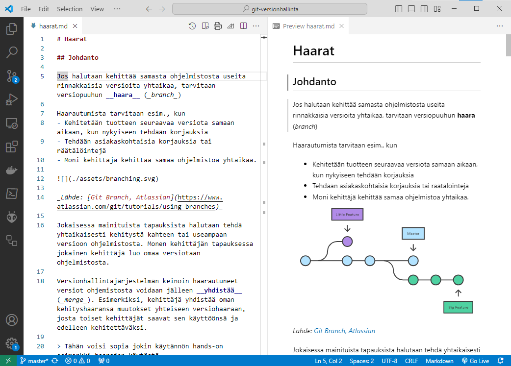

# Git-hosting-palvelut

Git-hosting tarkoittaa repositoriotilan ja Git-palvelujen tarjoamista verkossa käytettäväksi. 

Git-hosting voidaan tehdä yrityksen omilla palvelimilla (_self hosting_) tai internet-palveluntarjoajan palvelimilla (_cloud hosting_). 

Käytetyimmät palvelut ovat

- GitHub ([https://github.com/](https://github.com/))
- Bitbucket ([https://bitbucket.org/](https://bitbucket.org/))
- GitLab ([https://gitlab.com/](https://gitlab.com/))

Palvelut tarjoavat Git-toiminnallisuuden ja talletustilan lisäksi mm.

- Projektin jäsenten käsittelyn (_collaborators_)
- Vikaraportoinnin (_issue and bug tracking_)
- Projektinhallintatoiminnallisuutta (_agile boards_)

Ilmaisella tilillä on mahdollista toteuttaa pieniä projekteja. Maksullisilla tilauksilla saadaan suurempien projektien toteuttamiseen tarvittavia palveluja.

## Palvelujen käyttö

Kuten muissakin online-palveluissa, käyttäjien on avattava tili palvelussa. 
Tilille voi perustaa useita repositorioita (projekteja).

Palvelussa oleva repositorio toimii kehittäjän etärepositoriona. Palvelussa olevan etärepositorion kautta kehittäjä voi jakaa oman työnsä  muille, ja vastaavasti saada muiden kehittäjien tekemiä muutoksia omaan paikalliseen repositorioonsa.

Kirjautumisten helpottamiseksi palveluihin voi tallettaa SSH-salausavaimen, jolloin liikennöinti repositoryjen kanssa tapahtuu SSH-protokollalla ilman erillistä kirjautumista.

Repositorioita voi luoda palvelun web-käyttöliittymässä. Osa palveluista tukee myös repositoryn perustamista suoraan push-operaatiolla.

Repositorioihin voidaan lisätä jäseniä (_collaborator_), ja heille voidaan antaa erilaisia oikeuksia, esim. _guest_, _reporter_, _developer_, _maintainer_. 

Erilaisia toimintoja ja asetuksia on runsaasti, esim. notifikaatioita ja automatisointitoimintoja. 

Perehdy palveluntarjoajasi ohjeisiin. Kaikilla suurilla palveluilla on erinomainen dokumentaatio.

## README ja Markdown

Palvelut esittävät README-nimisen tiedoston repositoryn etusivulla. Yleensä siitä tehdään projektin kotisivu. README kirjoitetaan Markdown-kielellä. 

Markdown on yksinkertainen merkkauskieli, katso esim. [https://github.com/adam-p/markdown-here/wiki/Markdown-Cheatsheet](https://github.com/adam-p/markdown-here/wiki/Markdown-Cheatsheet).

Koodieditoreihin on saatavana Markdown tukilaajennuksia, esim. Visual Studio Code -editorissa on jo esiasennettuna esikatselu ja useita editointiaputoimintoja ([https://code.visualstudio.com/docs/languages/markdown](https://code.visualstudio.com/docs/languages/markdown)).

Markdownia käytetään usein projektien dokumentointiin, sillä siten saadaan dokumentaatiollekin samanlainen versionhallinta kuin koodille.



## Harjoitus 5

Viedään projekti GitHub-palveluun.

1. Lisää GitHubiin tyhjä repositorio. 
    - Älä anna GitHubin tehdä sinne mitään, ei edes README-tiedostoa!. 
    
    Mitä GitHub-repositoriosivulla näkyy?

2. Konfiguroi uusi repositorio paikallisen repositoriosi etärepositorioksi nimelle `origin`. 
     - Voit tarkistaa etärepositorioasetukset komennolla `git remote -v`.

3. Puske paikallisen repositorion `master`-haara GitHubiin. 

4. Mitä GitHub-repositoriosivulla nyt näkyy? Mitä haaroja näet GitHubissa, entä paikallisessa repositoriossasi?

5. GitHub-palvelun web-käyttöliittymässä voi myös tehdä muutoksia repositorioon. Luo GitHubin käyttöliittymässä jokin uusi tiedosto ja talleta muutos.

6. Etärepositoriossa on nyt eri sisältö kuin paikallisessa repositoriossasi. Hae muutokset paikalliseen repositorioon ja mene katsomaan niitä:
```bash
git fetch     # muutokset haetaan muttei yhdistetä
git checkout origin/master 
```
    Mikä muuttui?

1. Palaa `master`-haaraan. Mitä komento `status` sanoo?

2. Yhdistä `origin/master`-haaran muutokset. Mitä komento `status` nyt sanoo?

Vinkkejä:

- [GitHubin ohjeet repositorion luontiin](https://docs.github.com/en/repositories/creating-and-managing-repositories/creating-a-new-repository#creating-a-new-repository-from-the-web-ui)
- [GitHubin ohjeet tiedoston lisäämisestä GitHubin käyttöliittymässä](https://docs.github.com/en/repositories/working-with-files/managing-files/creating-new-files)
