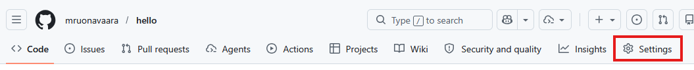
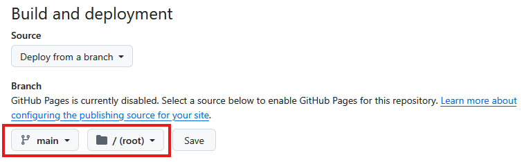

# Hosting-palvelujen toimintoja

Git-hosting-palvelut tarjoavat monia toimintoja, jotka helpottavat ohjelmistokehitystä ja projektinhallintaa. 

Tässä osiossa käydään läpi joitakin toimintoja, joita voidaan käyttää esimerkiksi opintojaksojen oppimistehtävissä.

Materiaalissa esitellään esimerkkinä GitHub-palvelun toimintoja, mutta muutkin hosting-palvelut (esim. GitLab, Bitbucket) tarjoavat vastaavat toiminnallisuudet.

## Verkkosivujen julkaiseminen

__GitHub Pages__ on GitHubin tarjoama staattisten verkkosivujen julkaisemiseen tarkoitettu palvelu, joka mahdollistaa verkkosivujen julkaisemisen suoraan GitHub-repositoriosta. Se on erityisen suosittu projektisivustojen ja henkilökohtaisten blogien ja  portfolioiden luomiseen.

!!! info "Mikä on staattinen verkkosivu?"

    Staattinen verkkosivu on sellainen, joka koostuu HTML-, CSS- ja JavaScript-tiedostoista, eikä se vaadi palvelinpuolen käsittelyä. Tämä tarkoittaa, että kaikki sivuston sisältö on valmiiksi luotuna ja tallennettuna, eikä se muutu dynaamisesti käyttäjän toiminnan perusteella.

### Julkaistavan sivuston sisältö

Sivuston sisältö julkaistaan repositoriosta. Sisältö voi olla joko HTML-sivusto tai Markdown-dokumentteja. 

Voit määrittää haaran, josta sisältö julkaistaan. Sisältö voi olla joko repositorion juuressa tai alihakemistossa `docs`. Julkaistavan sivustan aloitussivun nimeksi pitää antaa `index.html`, `index.md` tai `README.md`. 

### Julkaiseminen

GitHub Pages -sivuston julkaiseminen tehdään GitHub-palvelun verkkokäyttöliittymässä seuraavasti:

1. Siirry repositoryn asetuksiin (_Settings_). 

2. Etsi _GitHub Pages_ -osio ja valitse kohdata _Source_ (lähde) haluamasi haara ja hakemisto, josta sisältö julkaistaan.

3. Tallenna asetukset. GitHub luo automaattisesti verkkosivun repositoryn sisällöstä.
4. Sivusto on jetken kuluttua saatavilla osoitteessa `https://<käyttäjätunnus>.github.io/<repositorion-nimi>/`.

Voit muokata repositorion sisältöä, ja kun teet talletuksen haaraan,  muutokset päivittyvät automaattisesti verkkosivulle.

### Rajoituksia

GitHub Pages on tarkoitettu staattisten verkkosivujen julkaisemiseen, joten dynaamiset toiminnot, kuten tietokantayhteydet tai server-side-skriptit, eivät ole tuettuja. 

GitHub Pages on käytettävissä vain julkisille repositorioille, ellei sinulla ole maksullista GitHub-tiliä.

GitHub Pages -sivustoja ei saa käyttää kaupalliseen liiketoimintaan.

Lisäksi sivustoilla on teknisiä rajoituksia mm. sivuston koon ja liikennemäärän suhteen. Näistä saat lisätietoja GitHubin dokumentaatiosta https://docs.github.com/en/pages.

## Yhteistyö ja projektinhallinta

### Käyttäjien kutsuminen repositorioon

Yhteisten repositorioiden avulla voidaan kehittää projekteja muiden kehittäjien kanssa yhteistyössä. Repositorion omistaja voi kutsua muita käyttäjiä __kollaboraattoreiksi__. 

Kollaboraattorin kutsuminen tehdään GitHub-palvelun käyttöliittymässä seuraavasti:

1. Siirry repositoryn asetuksiin (_Settings_). 
2. Etsi _Collaborators_-osio ja valitse _Add people_ (lisää henkilöitä).
3. Hae GitHub-käyttäjä joko GitHub-käyttäjänimen tai sähköpostiosoitteen perusteella.
4. Kun painat _Add_, käyttäjä saa sähköpostitse kutsun liittyä repositorion kollaboraattoriksi. Käyttäjän on hyväksyttävä kutsu, ennen kuin hän saa oikeudet repositorioon.

Kollaboraattorioikeuksin voi tehdä muutoksia repositorion sisältöön (talletukset, haarat, tagit, yhdistämispyynnöt yms.), mutta ei voi hallinnoida repositoriota (esim. muuttaa asetuksia tai kutsua kollaboraattoreita). 

### Tehtävien hallinta

__GitHub Issues__ on työkalu vikailmoitusten tai muiden tehtävien hallintaan repositoriossa. Yksi tehtävä (__issue__) kuvaa yleensä yhden asian, joka pitää selvittää tai toteuttaa.

Tehtävien hallintaa käytetään tyypillisesti näin:

1. Avaa repositorio ja valitse _Issues_.
2. Luo uusi tehtävä painikkeella _New issue_.
3. Kirjoita selkeä otsikko ja kuvaus: mitä havaittiin, miten ongelma toistuu tai mitä halutaan toteuttaa.
4. Lisää tarvittaessa vastuuhenkilö (_assignee_), kenelle tehtävä kohdistetaan.

Tehtäviä voidaan tarkastella, niistä voidaan käydä kesksutelua, ja niiden etenemistä voidaan seurata sekä merkitä ne valmiiksi, kun asia on hoidettu (_Close issue_).

### Projektinhallinta

__GitHub Projects__ on projektinhallintatyökalu, jolla tehtäviä ja yhdistämispyyntöjä voidaan koota yhteen näkymään ja seurata työn etenemistä.

Projects-työkalua käytetään usein tauluna, jossa on sarakkeita kuten _To do_, _In progress_ ja _Done_. Työkohteita siirretään sarakkeesta toiseen työn edetessä.

Peruskäyttö etenee näin:

1. Avaa repositorio ja valitse _Projects_.
2. Luo uusi projekti (_New project_) ja valitse sopiva pohja (esim. _Board_).
3. Lisää projektiin tehtäviä.
4. Päivitä kohteiden tilaa siirtämällä niitä sarakkeiden välillä.
5. Seuraa kokonaiskuvaa projektinäkymästä ja päivitä tehtäviä säännöllisesti.

## Komentorivikäyttöliittymä

Tässä materiaalissa GitHub-palvelun toimintoja (esim. repositorioiden luonti tai yhdistämispyyntöjen käsittely) tehdään web-käyttöliittymässä. 

GitHub tarjoaa myös komentorivikäyttöliittymän __GitHub CLI__ (Command Line Interface), jolla toimintoja voidaan käyttää komentoriviltä, ilman selainta.

### Käyttö

Komentorivikäyttöliittymäohjelmisto pitää asentaa tietokoneelle. Asennusohjeet löytyvät GitHub CLI:n dokumentaatiosta https://docs.github.com/en/github-cli/github-cli/about-github-cli.

Asennuksen jälkeen GitHub CLI -komentoja voidaan antaa komentorivillä. Komennot alkavat aina `gh`.

Jotta komentoja voi antaa, on kirjauduttava GitHub-tilille komentorivillä:

``` bash 
  gh auth login
```
Komento avaa kirjautumissivun selaimessa. Kirjautuminen tarvitsee tehdä vain kerran. 

Joitakin yleisiä GitHub CLI -komentoja:
- `gh repo create`: Luo uusi repositorio
- `gh pr create`: Luo uusi yhdistämispyyntö (_pull request_)
- `gh issue create`: Luo uusi ongelma

Kaikki komennot ja niiden käyttöohjeet löytyvät GitHub CLI:n dokumentaatiosta https://cli.github.com/manual.


