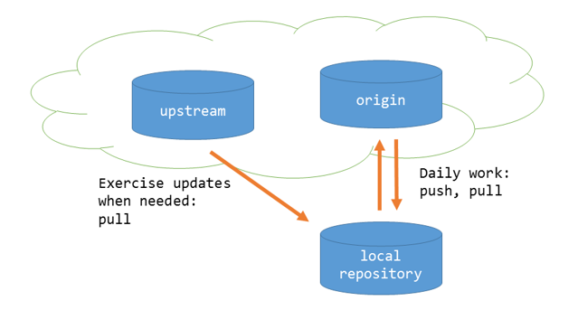

# Johdanto versionhallintaan

## Mitä on versionhallinta

Versionhallinnan tarkoituksena on tallettaa lähdekoodin versioiden muutoksia siten, että

- Saman ohjelmiston eri versioille voidaan antaa tunnisteet muuttamatta ohjelmakoodin sisältöä (esim. tiedostonimiä)
- Aikaisemmat versiot voidaan tarvittaessa palauttaa
- Ohjelmistosta voidaan kehittää useita eri versioita yhtaikaa hallitusti.
- Ohjelmistoon tehtyjä muutoksia voidaan seurata, dokumentoida ja hallita. 

Versionhallinta helpottaa ja tehostaa yksittäisen kehittäjän työtä. Ennen kaikkea se kuitenkin mahdollistaa ohjelmistojen tehokkaan kehittämisen ohjelmistotiimeissä. 

Versionhallinnan käyttö on yksi ohjelmistoalan ammattilaisen perustaitoja.

## Mikä on Git

Versionhallintajärjestelmiä on useita erilaisia. Käytännössä niistä __Git__ on muodostunut versionhallinnan de-facto standardiksi.

Syynä Git:n suosioon lienee, että se on 

- Avointa lähdekoodia. Git on lisensoitu avoimen lähdekoodin GPLv2-lisenssillä. 
- Ilmainen. 
- Hajautettu. Siinä ei ole minkäänlaista keskitettyä palvelinta. 
- Saatavilla kaikkiin ympäristöihin.

## Git-repositoriot

Git tallettaa kaiken informaation paikallisesti omaan tietovarastoonsa, jota kutsutaan nimellä __repositorio__. 

Lähes kaikki toiminnot voidaan tehdä paikallisesti. Voit siis kehittää ja tallettaa ohjelmiston versioita ilman verkkoyhteyttä.

Repositorio sijaitsee paikallisella koneella siinä hakemistossa, jossa ohjelmistoa kehitetään. 

## Repositorioiden hajautus ja synkronointi

Itsenäisten repositoryjen sisältöjä voidaan __synkronoida__ keskenään. Tähän tietysti tarvitaan verkkoyhteys. 



Repositorioiden sisältöjen synkronointi mahdollistaa niiden sisältöjen jakamisen useiden kehittäjien kesken. Tyypillinen malli on, että kehittäjät synkronoivat oman työnsä verkkopalvelussa sijaitsevaan repositorioon, ja saavat muiden kehittäjien tekemän työn sen kautta synkronoitua itselleen.

## Git:n käyttöönotto

### Komentorivi

Git:lle on useita graafisia käyttöliittymiä, myös Windows-asennuspaketissa on yksi sellainen. Tällä kurssilla käytämme kuitenkin __komentorivikomentoja__.  Niin tekevät useimmat ammattilaisetkin.

Windows-käyttöjärjestelmällä on kaksi __komentotulkkia__, _cmd_ ja _powershell_. Git:n Windows-asennus sisältää _Git Bash_ –komentotulkin, joka emuloi iOS- ja Linux-järjestelmiin esiasennettua _bash_-komentotulkkia

Git-komennot ovat kaikissa komentotulkeissa samat. Hakemistojen ja tiedostojen käsittelykomennot voivat eri komentotulkeissa poiketa toisistaan. 

Jos komentotulkin käyttäminen ei ole entuudestaan tuttua, voit perehtyä siihen esim. oheisen materiaalin avulla: 

- [Command line crash course](https://developer.mozilla.org/en-US/docs/Learn/Tools_and_testing/Understanding_client-side_tools/Command_line)

!!! note "Huomautus"

    Tässä materiaalissa käytetään mahdollisissa tiedostojärjestelmäkomennoissa bash-komentoja. 

### Konfigurointi

Asennuksen jälkeen on tarpeen tehdä joitakin konfigurointeja, ennen kuin git-käyttö voidaan aloittaa.

#### Käyttäjän tiedot

Jokaiseen talletettuun muutokseen tallentuu käyttäjän nimi ja sähköpostiosoite
Käyttäjätiedot tarvitsee asettaa tietokoneelle vain kerran, ja niitä voi tarvittaessa myöhemmin muuttaa
```
git config set –-global user.name ”Markku Ruonavaara”
git config set –-global user.email markku.ruonavaara@haaga-helia.fi
```

Konfigurointitietoja tallennetaan järjestelmä-, käyttäjä- ja projektikohtaisesti. Valitsin `-–global` viittaa siihen, että asetus on järjestelmä- ja käyttäjäkohtainen: se on voimassa tällä tietokoneella (järjestelmä) tämän käyttäjän kaikille repositorioille.

Jos mitään valitsinta ei määritetä, asetuksesta tulee projektikohtainen. Se tarkoittaa, että asetus on voimassa vain siinä repositoriossa, jossa se tehtiin. 

#### Editori

Joidenkin toimintojen yhteydessä Git käynnistää editorin tekstin kirjoittamista varten. Oletusarvoisesti se on systeemin oletuseditori, joka yleensä on vim.

Voit halutessasi asettaa editorin, jonka Git käynnistää. Seuraava komento asettaa editoriksi Visual Studio Code:n.

```
git config set --global core.editor "code --wait"
```

Konfiguroinnissa määritetään käynnistyskomento, joten jos editoria ei löydy polusta, voit joutua antamaan koko polun. 

Jos kuitenkin joskus päädyt vim-editoriin, oheisesta ohjeesta voi olla sinulle hyötyä:

- [https://www.linuxjournal.com/content/how-use-vi-editor-linux ](https://www.linuxjournal.com/content/how-use-vi-editor-linux )

GitHub-palvelun dokumentaation ohjeita editorien konfiguroinnista:

- [https://docs.github.com/en/get-started/getting-started-with-git/associating-text-editors-with-git](https://docs.github.com/en/get-started/getting-started-with-git/associating-text-editors-with-git)

#### Konfiguraatioasetusten tarkastelu

Kaikki asetukset voit tarkistaa näin:
```bash
git config list
```

Yhden parametrin arvon voit tarkistaa antamalla `config` komennon parametriksi parametrin nimen:
```
git config user.email
```

## Git-komennoista yleisesti

Kaikki Git-komennot alkavat `git`, sen jälkeen tulee varsinainen __komento__ (esim. `config`). Komennoilla voi olla __parametreja__. Tässä esimerkissä komennolle `config` annetaan parametriksi halutun konfiguraatioparametrin nimi `core.editor` 
```
git config core.editor
```
!!! note "Huomautus"
    Tässä materiaalissa Git-komentoihin viitataan tekstissä vain komento-osalla, esim. `config`. Komentorivillä annettava komento on tällöin `git config`. 

Komennoilla voi olla alikomentoja ja niille voidaan antaa __valitsimia__ (_option_), jotka täsmentävät, mitä halutaan tehdä. 

Tässä esimerkissä `list` on `config`-komennon alikomento, ja valitsin `--global` määrittää, että halutaan listata vain globaalit, kaikkiin repositorioihisi vaikuttavat parametrit.  
```
git config list --global
```
Joillekin valitsimille voi olla myös lyhyt muoto, esim. komennon `git status --short` valitsin `--short` voidaan myös antaa lyhyemmässä muodossa `-s`.  

Kaikille komennoille saa lyhyen opastustekstin valitsimella `-h`

```
$ git config -h
usage: git config list [<file-option>] [<display-option>] [--includes]
   or: git config get [<file-option>] [<display-option>] [--includes] [--all] [--regexp] [--value=<pattern>] [--fixed-value] [--default=<default>] [--url=<url>] <name>
   or: git config set [<file-option>] [--type=<type>] [--all] [--value=<pattern>] [--fixed-value] <name> <value>
   or: git config unset [<file-option>] [--all] [--value=<pattern>] [--fixed-value] <name>
   or: git config rename-section [<file-option>] <old-name> <new-name>
   or: git config remove-section [<file-option>] <name>
   or: git config edit [<file-option>]
   or: git config [<file-option>] --get-colorbool <name> [<stdout-is-tty>]
```
## Git-suomi -sanasto

Tässä materiaalissa käytetään Git-termeistä seuraavia suomenkielisiä vastineita:

Git | suomi
--- | ---
branch | haara
command line | komentorivi
commit | talletus
directory | hakemisto
fetch | _[haaran]_ haku _[etärepositoriosta]_
merge | yhdistäminen
_[command]_ option | valitsin
pull | _[haaran]_ tuonti _[etärepositoriosta]_
push | _[haaran]_ vienti _[etärepositorioon]_
remote | etärepositorio
repository | repositorio
shell | komentotulkki
working directory | työhakemisto


## Harjoitus 1

Pannaan ympäristö kuntoon harjoituksia varten.

1. Asenna koneellesi Git.
2. Tarkista, että asennus on onnistunut tulostamalla asennetun Git-version tunniste.

    ```bash
    git --version
    ```
    tai laajentimen `--version` lyhyemmällä muodolla
    ```
    git -v
    ```

3. Asenna Visual Studio Code (tai vastaava ohjelmointieditori).
4. Konfiguroi Git, ainakin käyttäjätiedot ja editori.
5. Avaa GitHub-palveluun tili. Sitä tullaan käyttämään kurssilla myöhemmin.

