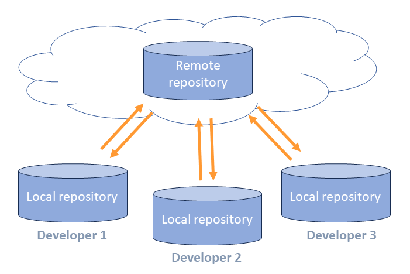

# Johdanto versionhallintaan

## Mitä on versionhallinta

Versionhallinnan tarkoituksena on tallettaa lähdekoodin versioiden muutoksia siten, että

- Saman ohjelmiston eri versioille voidaan antaa tunnisteet muuttamatta ohjelmakoodin sisältöä (esim. tiedostonimiä)
- Aikaisemmat versiot voidaan tarvittaessa palauttaa
- Ohjelmistosta voidaan kehittää useita eri versioita yhtaikaa hallitusti.
- Ohjelmistoon tehtyjä muutoksia voidaan seurata, dokumentoida ja hallita. 

Versionhallinta helpottaa ja tehostaa yksittäisen kehittäjän työtä. Ennen kaikkea se kuitenkin mahdollistaa ohjelmistojen tehokkaan kehittämisen ohjelmistotiimeissä. 

Versionhallinnan käyttö on yksi ohjelmistoalan ammattilaisen perustaitoja.

## Mikä on Git

Versionhallintajärjestelmiä on useita erilaisia. Käytännössä niistä __Git__ on muodostunut versionhallinnan de-facto standardiksi.

Syynä Git:n suosioon lienee, että se on 

- Avointa lähdekoodia. Git on lisensoitu avoimen lähdekoodin GPLv2-lisenssillä. 
- Ilmainen. 
- Hajautettu. Siinä ei ole minkäänlaista keskitettyä palvelinta. 
- Saatavilla kaikkiin ympäristöihin.

## Git-repositoriot

Git tallettaa kaiken informaation paikallisesti omaan tietovarastoonsa, jota kutsutaan nimellä __repositorio__. 

Lähes kaikki toiminnot voidaan tehdä paikallisesti. Voit siis kehittää ja tallettaa ohjelmiston versioita ilman verkkoyhteyttä.

Repositorio sijaitsee paikallisella koneella siinä hakemistossa, jossa ohjelmistoa kehitetään. 

## Repositorioiden hajautus ja synkronointi

Itsenäisten repositoryjen sisältöjä voidaan __synkronoida__ keskenään. Tähän tietysti tarvitaan verkkoyhteys. 



Repositorioiden sisältöjen synkronointi mahdollistaa niiden sisältöjen jakamisen useiden kehittäjien kesken. Tyypillinen malli on, että kehittäjät synkronoivat oman työnsä verkkopalvelussa sijaitsevaan repositorioon, ja saavat muiden kehittäjien tekemän työn sen kautta synkronoitua itselleen.

## Git:n käyttöönotto

### Komentorivi

Git:lle on useita graafisia käyttöliittymiä, myös Windows-asennuspaketissa on yksi sellainen. Tällä kurssilla käytämme kuitenkin __komentorivikomentoja__.  Niin tekevät useimmat ammattilaisetkin.

Windows-käyttöjärjestelmällä on kaksi __komentotulkkia__, _cmd_ ja _powershell_. Git:n Windows-asennus sisältää _Git Bash_ –komentotulkin, joka emuloi iOS- ja Linux-järjestelmiin esiasennettua _bash_-komentotulkkia

Git-komennot ovat kaikissa komentotulkeissa samat. Hakemistojen ja tiedostojen käsittelykomennot voivat eri komentotulkeissa poiketa toisistaan. 

Jos komentotulkin käyttäminen ei ole entuudestaan tuttua, voit perehtyä siihen esim. oheisen materiaalin avulla: 

- [Command line crash course](https://developer.mozilla.org/en-US/docs/Learn/Tools_and_testing/Understanding_client-side_tools/Command_line)

!!! note "Huomautus"

    Tässä materiaalissa käytetään mahdollisissa tiedostojärjestelmäkomennoissa bash-komentoja. 

### Konfigurointi

Asennuksen jälkeen on tarpeen tehdä joitakin konfigurointeja, ennen kuin git-käyttö voidaan aloittaa.

#### Käyttäjän tiedot

Jokaiseen talletettuun muutokseen tallentuu käyttäjän nimi ja sähköpostiosoite
Käyttäjätiedot tarvitsee asettaa tietokoneelle vain kerran, ja niitä voi tarvittaessa myöhemmin muuttaa
```
git config –-global user.name ”Markku Ruonavaara”
git config –-global user.email markku.ruonavaara@haaga-helia.fi
```

Konfigurointitietoja tallennetaan systeemi-, käyttäjä- ja projektikohtaisesti. Tarkennin `-–global` viittaa siihen, että asetus on systeemikohtainen.

#### Editori

Joidenkin toimintojen yhteydessä Git käynnistää editorin tekstin kirjoittamista varten. Oletusarvoisesti se on systeemin oletuseditori, joka yleensä on vi.

Voit halutessasi asettaa editorin, jonka Git käynnistää. Seuraava komento asettaa editoriksi Visual Studio Code:n.

```
git config --global core.editor "code --wait"
```

Konfiguroinnissa määritetään käynnistyskomento, joten jos editoria ei löydy polusta, voit joutua antamaan koko polun. 

Jos kuitenkin joskus päädyt vi-editoriin, oheisesta ohjeesta voi olla sinulle hyötyä:
- https://www.linuxjournal.com/content/how-use-vi-editor-linux 

#### Konfiguraatioasetusten tarkastelu

Kaikki asetukset voit tarkistaa näin:
```bash
git config –-list
```

Yhden parametrin arvon voit tarkistaa antamalla `config` komennon parametriksi parametrin nimen:
```
git config user.email
```

## Git-komennoista yleisesti

Kaikki Git-komennot alkavat `git`, sen jälkeen tulee varsinainen __komento__ (esim. `config`). Komennoilla voi olla __parametreja__. Tässä esimerkissä komennolle `config` annetaan parametriksi halutun konfiguraatioparametrin nimi `core.editor` 
```
git config core.editor
```
!!! note "Huomautus"
    Tässä materiaalissa Git-komentoihin viitataan tekstissä vain komento-osalla, esim. `config`. Komentorivillä annettava komento on tällöin `git config`. 

Komennoille voidaan antaa myös valitsimia (_option_), jotka täsmentävät, mitä halutaan tehdä. Tässä esimerkissä valitsin `--list` määrittää, että halutaan listata konfiguraatioparametrit, ja valitsin `--global`, että halutaan vain globaalit, kaikkiin repositorioihisi vaikuttavat parametrit.  
```
git config --list --global
```
Joillekin valitsimille voi olla myös lyhyt muoto, esim. edellisen esimerkin valitsin `--list` voidaan myös antaa lyhyemmässä muodossa `-l`.  

Kaikille komennoille saa lyhyen opastustekstin valitsimella `-h`

```
$ git config -h
usage: git config [<options>]

Config file location
    --global              use global config file
    --system              use system config file
    --local               use repository config file
    --worktree            use per-worktree config file
    -f, --file <file>     use given config file
    --blob <blob-id>      read config from given blob object

Action
    --get                 get value: name [value-pattern]
    --get-all             get all values: key [value-pattern]
    --get-regexp          get values for regexp: name-regex [value-pattern]
    --get-urlmatch        get value specific for the URL: section[.var] URL
    --replace-all         replace all matching variables: name value [value-pattern]
    --add                 add a new variable: name value
    --unset               remove a variable: name [value-pattern]
    --unset-all           remove all matches: name [value-pattern]
    --rename-section      rename section: old-name new-name
    --remove-section      remove a section: name
    -l, --list            list all
    --fixed-value         use string equality when comparing values to 'value-pattern'
    -e, --edit            open an editor
    --get-color           find the color configured: slot [default]
    --get-colorbool       find the color setting: slot [stdout-is-tty]

Type
    -t, --type <type>     value is given this type
    --bool                value is "true" or "false"
    --int                 value is decimal number
    --bool-or-int         value is --bool or --int
    --bool-or-str         value is --bool or string
    --path                value is a path (file or directory name)
    --expiry-date         value is an expiry date

Other
    -z, --null            terminate values with NUL byte
    --name-only           show variable names only
    --includes            respect include directives on lookup
    --show-origin         show origin of config (file, standard input, blob, command line)
    --show-scope          show scope of config (worktree, local, global, system, command)
    --default <value>     with --get, use default value when missing entry

```
## Git-suomi -sanasto

Tässä materiaalissa käytetään Git-termeistä seuraavia suomenkielisiä vastineita:

Git | suomi
--- | ---
branch | haara
command line | komentorivi
commit | talletus
directory | hakemisto
fetch | _[haaran]_ haku _[etärepositoriosta]_
merge | yhdistäminen
_[command]_ option | valitsin
pull | _[haaran]_ tuonti _[etärepositoriosta]_
push | _[haaran]_ vienti _[etärepositorioon]_
remote | etärepositorio
repository | repositorio
shell | komentotulkki
working directory | työhakemisto


## Harjoitus 1

Pannaan ympäristö kuntoon harjoituksia varten.

1. Asenna koneellesi git ja Visual Studio Code (tai vastaava ohjelmointieditori).
2. Konfiguroi Git, ainakin käyttäjätiedot ja editori.
3. Avaa GitHub-palveluun tili.

