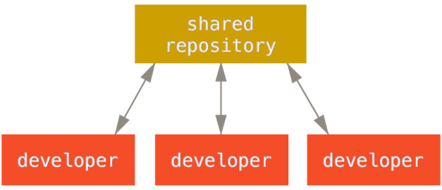
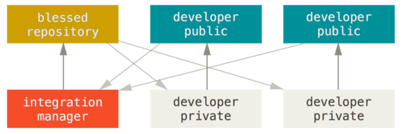
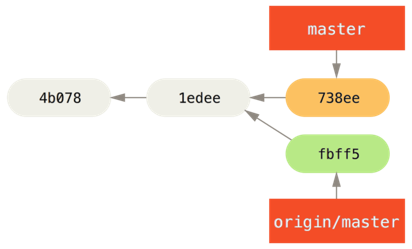
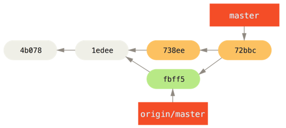
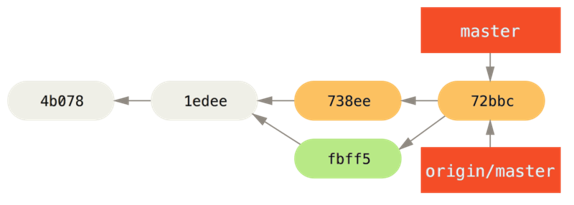
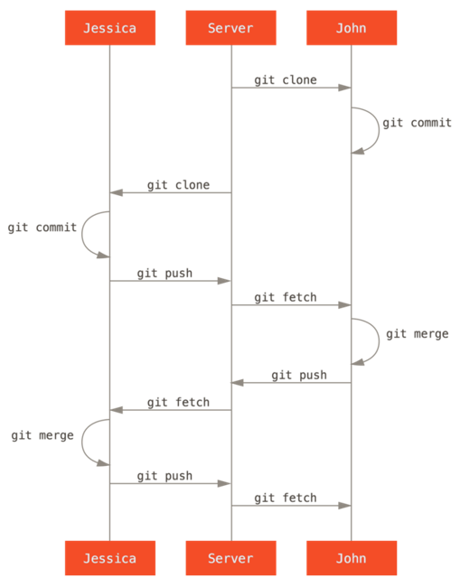
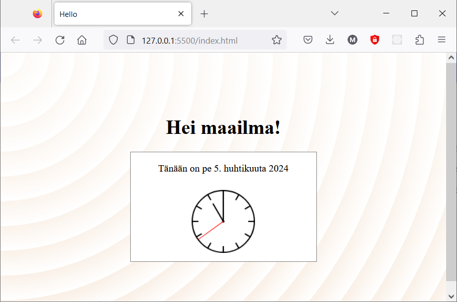

# Git projektissa

## Työnkulut hajautetussa Git-ympäristössä

Git:n käyttö perustuu siihen, että kaikki tapahtuu paikallisessa repositoryssä. Kun projektissa on useita kehittäjiä, eri kehittäjien työ jaetaan toisille etärepositoryjen avulla.

Etä-repositoryt voidaan organisoida usein eri tavoin, ja niiden käyttöön voidaan laatia erilaisia työnkulkuja. Työnkulku vastaa kysymyksiin
- Miten organisoin oman työni omassa repositoryssani, jotta sen vieminen yhteiseen projektiin onnistuu
- Miten vien oman työni yhteiseen projektiin
- Miten saan muiden työt omaan repositoryyni

Seuraavassa esitellään esimerkinomaisesti kaksi erilaista tapaa organisoida versionhallinnan työnkulkuja projektissa.

### Keskitetty malli

Keskitetyssä mallissa projektilla on yksi yhteinen repositorio, jonka kanssa kaikki kehittäjät synkronoivat oman työnsä. 



_Lähde: [Chacon S., Straub B, Pro Git, luku 5.](https://git-scm.com/book/en/v2/Git-Branching-Branches-in-a-Nutshell) [CC BY-NC-SA 3.0](https://creativecommons.org/licenses/by-nc-sa/3.0/)_

Kehittäjät hakevat muiden muutokset keskitetystä repositoriosta, liittävät ne omiin muutoksiinsa, ja vievät lopuksi omat muutoksensa yhteiseen repositorioon.

Mallin käyttäminen edellyttää, että kaikilla projektin kehittäjillä on oikeudet viedä muutoksia yhteiseen repositorioon (_push_).

### Integrointimanagerimalli

Julkisissa projekteissa (esim. avoimen lähdekoodin projekteissa) ei ole mahdollista antaa kaikille projektin jäsenille oikeuksia muuttaa yhteisen repositorion sisältöä. 

Tällöin Git-versionhallinnassa voidaan soveltaa mallia, jossa jokaisella kehittäjillä on oma julkinen repositorio ja lukuoikeudet toistensa repositorioihin.

Yksi repositorio on yhteinen ”virallinen”, johon kaikilla on lukuoikeus, mutta jonne vain projektin ylläpitäjällä (_integraatiomanageri_) on oikeus viedä muutoksia.



_Lähde: [Chacon S., Straub B, Pro Git, luku 5.](https://git-scm.com/book/en/v2/Git-Branching-Branches-in-a-Nutshell) [CC BY-NC-SA 3.0](https://creativecommons.org/licenses/by-nc-sa/3.0/)_

Kukin kehittäjä julkaisee muutoksensa omaan julkiseen repositorioonsa ja lähettää ylläpitäjälle pyynnön yhdistää ne viralliseen repositorioon. 

Tätä työnkulkua tässä materiaalissa ei käsitellä tämän enempää.  

## Talletusten käytännöt

Tallennusten kommentit viestittävät projektin kehittäjille, mitä muutoksia toiset ovat projektiin tehneet. Talletusten kommentoinnin käytännöistä on syytä sopia projektissa yhteisesti.

Kommentointiin on vakiintuneita hyviä käytäntöjä, esim. [How to Write a Git Commit Message](https://cbea.ms/git-commit/). Niiden mukaan kommentteihin on hyvä kirjata
- Lyhyt (max 50 merkkiä), otsikkotyyppinen kuvaus ensimmäiselle riville.
- Tarvittaessa pidempi kuvaus muutoksesta ja se syistä rivinvaihdolla erotettuna.

Jokaisesta loogisesta kokonaisuudesta kannattaa tehdä erillinen talletus. Tällöin muutosten tarkastelu ja käsittely projektissa on mahdollisimman selkeää. Vaikka olisit kehittänyt useita ominaisuuksia kerralla, voit `add`-vaiheessa jakaa muutokset eri talletuksiin. 

Ylimääräinen white-space (välilyönnit, tabulaattorit, rivinvaihdot jne.) ei vaikuta suoritukseen mutta voi näkyä Git-talletuksissa muille turhina muutoksia. Voit tarkistaa sellaiset `diff`-komennolla:
```bash
$ git diff --check
```

Editoreissa on ominaisuuksia, jolla white-space-ongelmat voidaan poistaa automaattisesti.

## Yhteistyö keskitetyssä mallissa

Yksinkertaisin malli, jota useimmissa pienissä projekteissa käytetään, on keskitetty. Kaikilla kehittäjillä on tällöin kirjoitusoikeudet yhteiseen repositorioon.

Aluksi kaikki kloonaavat yhteisen repositoryn

```bash
$ git clone <repository-url>
```

Muutokset tehdään omassa repositoriossa ja talletetaan sinne, kukin kehittäjä omaan tahtiinsa.

```bash
$ git commit
```

Kun muutokset ovat valmiita, ne voidaan viedä yhteiseen repositorioon 

```bash
$ git push origin master
```
1. Tilanne komennon `fetch jälkeen`:



2. Tilanne komennon `merge` jälkeen:


3. Tilanne komennon `push` jälkeen:
   


_Lähde: [Chacon S., Straub B, Pro Git, luku 5.](https://git-scm.com/book/en/v2/Git-Branching-Branches-in-a-Nutshell) [CC BY-NC-SA 3.0](https://creativecommons.org/licenses/by-nc-sa/3.0/)_

Lopputilanteessa oma repositorio ja yhteinen repositorio ovat samalla tasalla, ja `origin/master`-haaran tuoreimmassa talletuksessa on versio, jossa on yhdistetty kaikkien kehittäjien tähänastiset muutokset.  

## Rinnakkaiset muutokset

Edellä kuvattu onnistuu noin suoraviivaisesti kuitenkin vain, jos kehittäjät tekevät muutokset vuorotellen. 

Toiset kehittäjät voivat  olla julkaisseet uusia muutoksia sillä aikaa kun kehität omiasi. Tällöin versiopolut erkanevat. 

Ennen kuin omat muutokset voidaan viedä yhteiseen repositorioon, on haettava sieltä muiden mahdollisesti tekemät uudet muutokset omaan repositorioon. 

Muiden muutokset on yhdistettävä omiin muutoksiin ja mahdolliset konfliktit ratkottava. Vasta sitten valmis ja testattu lopputulos voidaan viedä yhteiseen repositorioon.

Seuraavassa esimerkissä käydään oman ja muiden kehittäjien muutosten yhdistäminen läpi vaihe vaiheelta: 

```bash
$ git fetch origin          # 1, haetaan muiden tekemät muutokset
$ git merge origin/master   # 2. yhdistetään ne omiin muutoksiin
# ...ratkotaan mahdolliset konfliktit
$ git push origin master    # 3. viedään valmis lopputulos yhteiseen repositorioon
```

Vaiheet 1 ja 2 (`fetch` ja `merge`) tehdään usein kerralla komennolla `pull`.

```bash
$ git pull origin master
```
Huomaa, että `pull` voi aiheuttaa konflikteja, sillä se tekee myös yhdistämisen. Jos tilanne näyttää liian sekavalta, keskeneräisen yhdistämisen voi peruuttaa komennolla `git merge --abort`. 

Voit tarkistaa etukäteen, onko etärepositoriossa uusia talletuksia, tekemällä `fetch`-toiminnon. Tällöin `status` kertoo tilanteen.

```
$ git status
On branch main
Your branch is behind 'origin/main' by 2 commits, and can be fast-forwarded.
  (use "git pull" to update your local branch)
```

## Yhteenvetoa
Jokaisesta loogisesta kokonaisuudesta kannattaa tehdä erillinen talletus. Tällöin muutosten tarkastelu ja käsittely projektissa on mahdollisimman selkeää. 

Talletusten kommentointi on tärkeää projketin kehittäjien välisen kommunikoinnin kannalta. Noudata hyviä kommentointikäytäntöjä. 

Seuraava kuva summaa tyypillisen työnkulun projektissa, jossa noudatetaan keskitettyä mallia. 



_Lähde: [Chacon S., Straub B, Pro Git, luku 5.](https://git-scm.com/book/en/v2/Git-Branching-Branches-in-a-Nutshell) [CC BY-NC-SA 3.0](https://creativecommons.org/licenses/by-nc-sa/3.0/)_

- Alussa kehittäjät kloonaavat yhteisen repositorion. Näin he saavat olemassaolevan koodin työtilaansa ja voivat jatkaa kehitystä.
- Kukin kehittäjä tekee oman työnsä omassa repositoriossaan.
- Ennen omien muutosten julkaisemista kunkin kehittäjän on tuotava omaan repositorioonsa se haara, johon uudet muutokset halutaan viedä.
- Etärepositoriosta saadut muutokset pitää yhdistää omiin muutoksiin. Tuloksena saadaan tallennus, jossa on kaikki tämänhetkiset muutokset.
- Uusi tallennus viedään yhteiseen repositorioon, josta muut kehittäjät puolestaan voivat hakea sen itselleen.

## Harjoitus 6

Harjoitellaan ohjelmiston kehittämistä ja muutosten synkronointia verkkopalvelussa sijaitsevan etärepositorion kanssa. 

!!! note "Tehtävän esivalmistelut"

    Tähän tehtävään saat virtuaalisen tiimikaverin. Hän jatkokehittää aiemmissa harjoituksissa laadittua sovellusta kanssasi.
    
    Tehtävän suorittamiseksi on repositorioosi tehtävä valmisteluja. Anna seuraavat komennot:

    ```
    git remote add actions https://github.com/mruonavaara/git-actions.git
    git fetch actions main
    git merge actions/main --allow-unrelated-histories
    ``` 

    Harjoitus perustuu aiemmin tehtyihin harjoituksiin, ja sen tekemisessä tarvitaan kaikkien aiempien osioiden oppeja! 

Kehitätte `hello`-sovellusta projektitiimissä. Olette sopineet seuraavat versionhallintakäytännöt:

- Kukin tekee omat muutoksensa aina ensin haaraan nimeltä `develop`.
- Päähaaraan viedään vain versioita, jotka on testattu ja yhteisesti todettu valmiiksi. 

Projektissa seuraavaksi lisätään sovellukseen toiminta, jolla käyttäjälle näytetään kellonaika. Sait tehtäväksesi lisätä nappulan, jolla käyttäjä voi pyytää näyttämään kellonajan. 

!!! note "Huomautus"

    Virtuaalinen tiimikaverisi olettaa, että `hello`-sivusto on repositorion juurihakemistossa. Jos se on alihakemistossa, siirrä se tehtävää varten repositorion juureen.

1. Versionhallintakäytännön mukaisesti siirry haaraan `develop`. Sitä ei vielä ole, joten se pitää luoda.

    ``` { .bash .no-copy }
    git switch -c develop
    ```

    Sitä ei ole etärepositoriossakaan, viedään se sinne.

    ``` { .bash .no-copy }
    git push -u origin develop # -u on sama kuin --set-upstream
    ```
   
2. Lisää html-tiedostoon `<main>`-osioon nappulaelementti päivämäärää ja kellonaikaa varten sekä nappula, jota painamalla tiedot näytetään:

    ```html
    <div id="datetime"></div>
    <button>Mitä kello on?</button>
    ```

    Nappula ei vielä toimi, mutta ei huolta, tiimikaverisi toteuttaa sen toiminnallisuuden.

    Testaa sivu. Kun olet tyytyväinen lopputulokseen, talleta muutokset `develop`-haaraan.
    
    Vie `develop`-haara GitHub-palvelussa olevaan etärepositorioon.

3. Huomaat, että tiimikaverisi on tehnyt nappulatoiminnallisuuden (mistä?). Liitä JavaScript-tiedosto ohjelmaasi lisäämällä `<body>`-osion loppuun 

    ```html
    <script src="scripts.js"></script>
    ```
    Hän on kirjannut talletuskommenttiin myös ohjeet, miten toiminnallisuus liitetään nappulaan.

    Liitä toiminnallisuus nappulaan ja testaa, että nappula toimii. 
    
    Kun olet tyytyväinen, talleta muutos ja vie se yhteiseen kehityshaaraan.

4. Toteat, että perusnappula näyttää ankealta. Määritä sille paremmat tyylimääritykset CSS-tiedostoon, esim.

    ```css
    button {
      background-color: blue;
      color: white;
      margin: 10px;
      padding: 8px;
      border-radius: 8px;
    }
    ```
    Testaa sivu. 
    
    Kun olet tyytyväinen lopputulokseen, talleta muutokset `develop`-haaraan ja vie etärepositorioon.

5. Scrum-kokouksessa aamulla päätettiin muuttaa toimintaa niin, että kellonaika näytetäänkin jatkuvasti. Tiimikaverisi on jo ehtinyt toteuttaa JavaScript-toiminnallisuuden, sinun tehtäväksesi sovittiin tarpeettomaksi käyneen nappulan poistaminen.

    Hae tiimikaverisi muutokset ja poista kaikki nappulaan liittyvä tarpeeton koodi, testaa, että kaikki toimii.
    
    Kun muutos on valmis, vie se yhteiseen kehityshaaraan.

6.  Seuraavassa Scrum-kokouksessa todetaan, että ominaisuus on valmis esiteltäväksi sprintin katselmoinnissa `develop`-haaran uusimman version mukaisena. 

    Yhdistä se päähaaraan. Muista viedä päähaarakin etärepositorioon!

Lopputulos näyttää jokseenkin tämänkaltaiselta:



Eikö lopputulos näytä samalta? Muistitko hakea muiden tuoreimmat muutokset ennen yhdistämistä? Jos et, hae ne, testaa `develop`-haarassa ja yhdistä sitten uudelleen päähaaraan.

??? note "Haluatko kokeilla uudelleen?"

    Jos haluat tehdä tehtävän uudelleen, voit poistaa sekä paikallisen repositorion että etärepositorion `develop`-haaran ja palata alkukohtaan. Siirry repositoriosi päähaaraan ja anna seuraavat komennot:

    ```bash
    git branch -D develop # poistetaan paikallinen develop
    git push origin --delete develop # poistetaan origin-etärepositorion develop
    ```
    Mitä tapahtuu haaraan tehdyille talletuksille? 
    
    Kuten aiemmin luvattiin, kaikki, mikä on versionhallintaan talletettu, säilyy siellä. Niin nämäkin, mutta haaraviittaus niihin (`develop`) on poistettu. Talletuksia on vaikeampi löytää ja käsitellä, mutta ne on mahdollista palauttaa.
    


