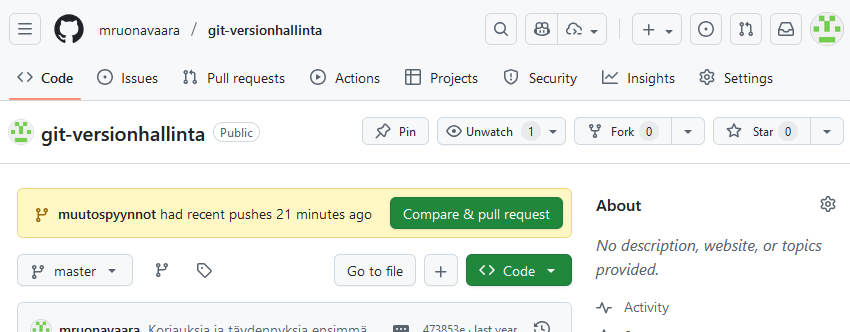
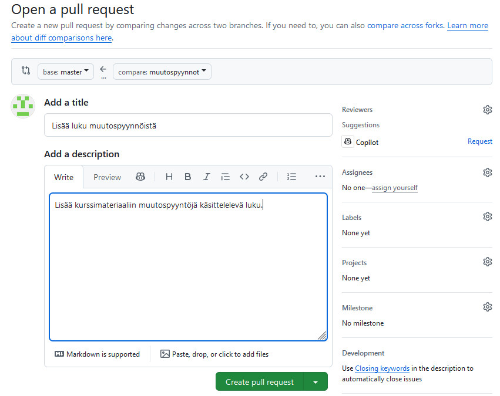
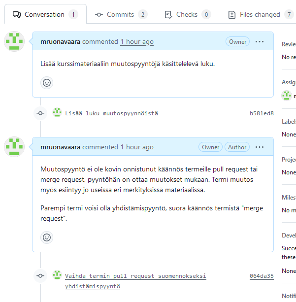
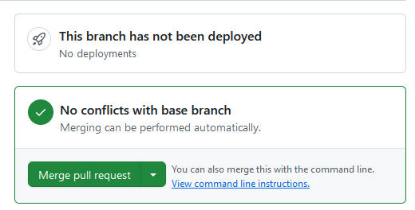
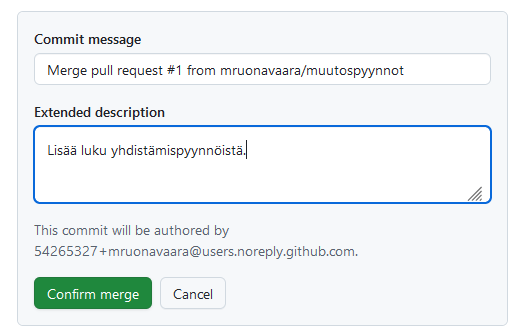
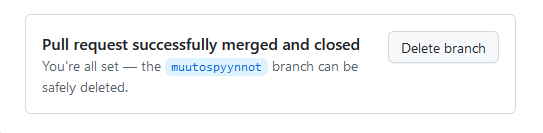
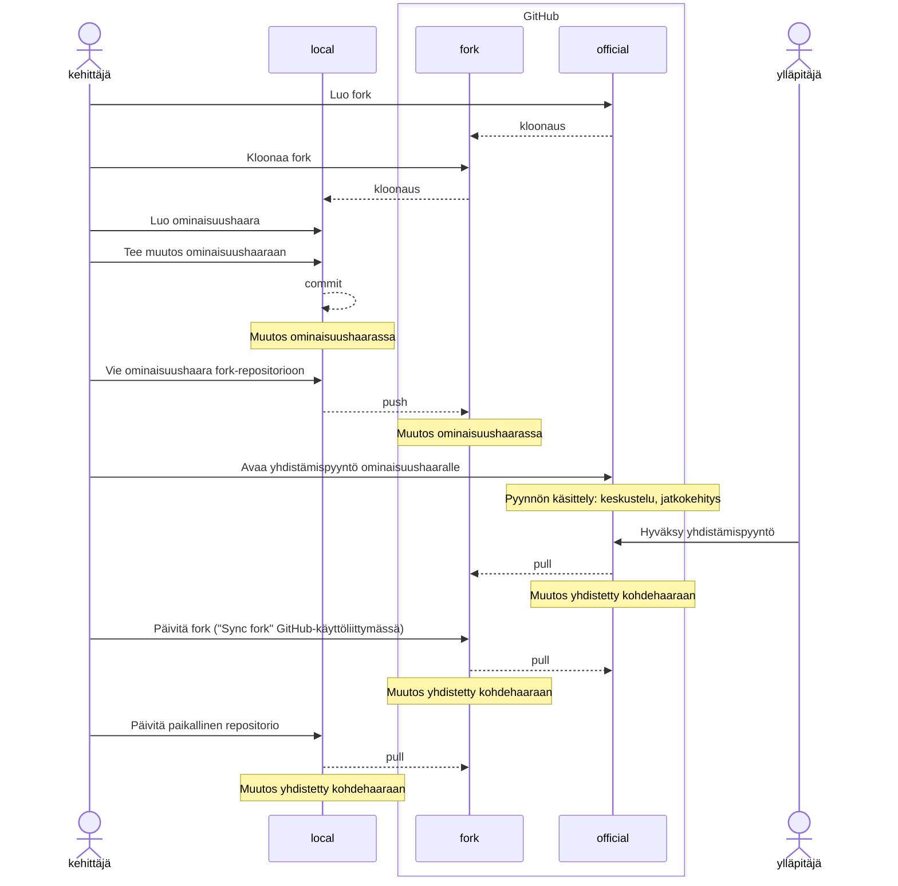

# Yhdistämispyynnöt

## Johdanto

Git-palvelut tarjoavat toiminnallisuutta, jossa Git-repositorihin voi tehdä __yhdistämispyyntöjä__ (_pull request_, _merge request_). Yhdistämispyyntö on ehdotus repositorion ylläpitäjille yhdistää pyynnön tekijän laatimat muutokset repositorion johonkin haaraan.

Yhdistämispyyntöihin voidaan liittää tietoja muutoksesta, kehittäjät voivat keskustella siitä, yhdistämispyyntöä voidaan jatkokehittää, ja muutospyynnöille voidaan määrittää katselmointityönkulkuja. 

Kaikki Git-palvelut tarjoavat samanlaisen toiminnallisuuden. Tässä materiaalissa eismerkkinä käytetään GitHub-palvelun yhdistämispyyntöjä.

## Yhdistämispyynnön tekeminen  

Pyynnön oleelliset tiedot ovat:

- mistä repositoriosta ja haarasta muutoksia ehdotetaan 
- mihin repositorioon ja haaraan ne haluttaisiin mukaan
- muutoksen otsikko ja kuvaus

Tavallisin tapa on tehdä ehdotettava muutos omaan ominaisuushaaraansa ja tehdä haaralle yhdistämispyyntö. Kohdehaara on jokin projektissa sovittu yhteinen haara. 

Yhdistämispyynnölle annetaan 

- otsikko, jolla se esitetään listauksissa, ja 
- pyynnön käsittelijöitä varten kuvaus, mikä muutos on ja miksi sitä ehdotetaan.

Seuraavassa esimerkissä tehdään yhdistämispyyntö GitHub-palvelussa.

Ensin ehdotettava muutos on tehtävä paikallisesti. Sille tehdään ominaisuushaara ja viedään muutokset siihen. Ominaisuushaara täytyy viedä etärepositorioon GitHub-palvelussa, jotta sille voidaan tehdä yhdistämispyyntö.

```
git switch -c muutospyynnot
git add .
git commit -m "Lisää luku muutospyynnöistä"
git push -u origin muutospyynnot
```



Kun haara näkyy etärepositoriossa, yhdistämispyyntö voidaan tehdä GitHubin web-käyttöliittymässä.



Yhdistämispyyntö voidaan kohdistaa yhdelle tai useammalle repositorion ylläpitäjälle käsiteltäväksi tai katselmoitavaksi. Tällöin he saavat notifikaation pyynnöstä.

## Yhdistämispyynnön käsittely

Yhdistämispyyntöä voidaan kommentoida, ja siitä käyty keskustelu tallentuu yhdistämispyyntöön. 
Yhdistämispyyntöä voidaan myös täydentää, siis tehdä uusia talletuksia sen haaraan.



Kun pyyntöön ollaan tyytyväisiä, se voidaan hyväksyä. Tässä tapauksessa yhdistäminen onnistuu automaattisesti. Jos muutos aiheuttaisi konflikteja, ne olisi ensin ratkaistava. 



Yhdistämisen tuloksena syntyy uusi talletus etärepositorioon.



Kun yhdistämispyynnön ominaisuushaara on yhdistetty, haara voidaan poistaa etärepositoriosta.



Paikallinen repositorio pitää nyt päivittää, sillä uudet muutokset ovat vasta etärepositoriossa. Huomaa, että yhdistämispyynnön haara on vielä tallella paikallisesti, se pitää poistaa erikseen.

```
# git switch master
Your branch is behind 'origin/master' by 3 commits, and can be fast-forwarded.
  (use "git pull" to update your local branch)
# git pull         
Updating 473853e..9fe0f50
Fast-forward
 docs/assets/pr_create_form.png      | Bin 0 -> 47869 bytes
 docs/assets/pr_feature_branch.png   | Bin 0 -> 41894 bytes
 docs/assets/pr_list.png             | Bin 0 -> 22471 bytes
 docs/muita_toimintoja.md            |   2 +-
 "docs/muutospyynn\303\266t.md"      |  38 ++++++++++++++++++++++++++++++++++++
 docs/versionhallinta_projektissa.md |   4 +---
 mkdocs.yml                          |   4 +++-
 7 files changed, 43 insertions(+), 5 deletions(-)
# git branch
* master
  muutospyynnot
# git branch -d muutospyynnot
```

## Yhdistämispyynnöt repositoriosta toiseen

Edellisessä esimerkissä yhdistämispyyntöjä tehtiin yhden repositorion sisällä. Pyyntöjä on mahdollista tehdä myös eri repositorioiden kesken.

Tällöin yhdistämispyynnön tekijällä on oltava Git-palvelussa __oma versio__ repositoriosta, johon muutoksia halutaan ehdottaa, ja ehdotettava muutoshaara tehdään tähän repositorioon. 

Git-palvelut tarjoavat fork-toiminnon, jolla voi yhdellä klikkauksella luoda itselleen oman version toisesta repositoriosta. Kehittäjällä on siis aina kaksi versiota kohderepositoriosta: Git-palvelussa oleva fork-repositorio sekä paikallinen repositorio, jossa muutoksia työstetään ja jonka etärepositorio fork on.

Repositorioiden käyttöoikeuksien pitää olla määritelty niin, että sekä yhdistämispyynnön tekijä että vastaanottajat näkevät toistensa repositoriot. Jos ne ovat julkisia, näin on aina.

### Avoimen lähdekoodin versionhallinta

Avoimen lähdekoodin projekteissa kuka tahansa voi itsenäisesti kehittää projektiin muutoksia. Ei kuitenkaan ole mahdollista antaa suoria muutosoikeuksia repositorioihin kenelle tahansa. Tällöin käytetään forking-työnkulkua:

1. Kehittäjä tekee Git-palvelussa fork-repositorion projektin virallisesta repositoriosta. Virallinen repositorio on julkinen, niinpä oma fork on myös julkinen.
2. Hän kloonaa fork-repositorion koneelleen. Tässä repositoriossa tehdään oma kehitys.
3. Jotta oma kopio voisi pysyä ajan tasalla virallisen repositorion muutosten kanssa, myös virallinen repositorio on konfiguroitava paikallisen repositorion etärepositorioksi. Tapana on antaa etärepositorion nimeksi `upstream`
4. Uusi kehitys tehdään ominaisuushaaraan. 
5. Ominaisuushaara viedään omaan fork-repositorioon. 
6. Kehittäjä avaa uuden yhdistämispyynnön viralliseen repositorioon. Lähdehaaraksi asetetaan fork-repositorion ominaisuushaara.
7. Virallisen repositorion ylläpitäjä käsittelee yhdistämispyynnön. Hän yhdistää pyynnön haaran ensin omaan paikalliseen repositorioonsa testatakseen sen, ja hyväksyy tai sulkee yhdistämispyynnön. Pyynnöstä voidaan käydä keskustelua ja pyyntöhaaraa voidaan kehittää edelleen.
8. Jos pyyntö hyväksyttiin, kehittäjän täytyy päivittää omien repositorioidensa sisällöt vastaamaan virallisen repositorion uutta sisältöä. Hän siis tuo oman muutoksensa `upstream`-etärepositoriosta takaisin siinä haarassa, johon se virallisessa repositoriossa yhdistettiin. Nythän se on virallista sisältöä!



## Yhdistämispyynnöt projekteissa

Projekteissa, joissa on useita kehittäjiä, yhdistämispyynnöt tarjoavat mahdollisuuden muutoksista keskusteluun ja niiden työstämiseen usean kehittäjän kesken. Yhdistämispyyntöjä käyttämällä voidaan parantaa projektin laadun- ja muutostenhallintaa. Esimerkiksi,

- voidaan edellyttää, että kaikki muutokset projektin päähaaraan on tehtävä yhdistämispyyntöinä
- vaaditaan, että yhdistämispyynnöt on aina katselmoitava tietyllä tapaa
- yhdistämispyynnöille voidaan ajaa automaattisia tarkastuksia ja testejä.

Git-palvelut tukevat monipuolisesti erilaisten käyttöoikeuksien myöntämistä eri käyttäjille ja erilaisten työnkulkujen täytäntöönpanoa. Niihin ominaisuuksiin voit tutustua perehtymällä palveluntarjoajasi dokumentaatioon.

## Harjoitus 7

Harjoitellaan yhdistämispyyntöjen tekemistä, käsittelyä ja hyväksymistä. 

1. Tee harjoituksen 6 repositorioon yhdistämispyyntö:

      1. Luo uusi haara paikalliseen repositorioosi muutoksia varten
      2. Tee muutokset ominaisuushaaraan paikallisessa repositoriossa
      3. Vie ominaisuushaara etärepositorioon
      4. Tee GitHubissa pyyntö yhdistää ominaisuushaara etärepositoriosi päähaaraan.
   
2. Kommentoi pyyntöäsi. 
3. Tee pyynnön haaraan toinen talletus ja vie se etärepositorioon.
4. Hyväksy yhdistämispyyntö ja poista ominaisuushaara etärepositoriosta.
5. Päivitä paikallinen repositoriosi vastaamaan etärepositorion sisältöä, ja poista paikallinen ominaisuushaara.

Lopputuloksena 

- Etärepositorioon on syntynyt uusi muutos.
- Muutoksesta on jäänyt selkeä dokumentaatio, joka on nähtävissä repositoriossa GitHubissa.
- Paikallinen repositorio on samassa tilassa kuin etärepositorio.


