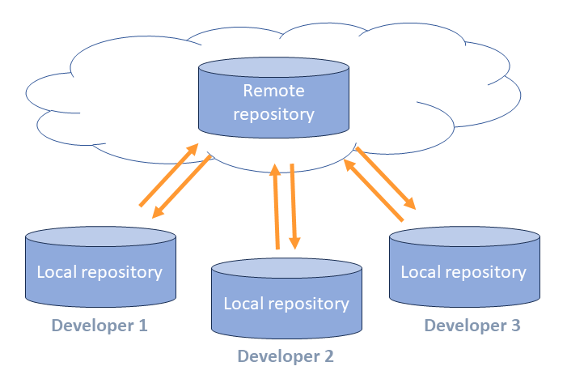

# Etärepositoriot

## Repositoriouden hajautus

Kuten jo aiemmin todettiin, git tallettaa kaiken informaation paikallisesti omaan tietovarastoonsa, jota kutsutaan repositorioksi. Paikallinen tietovarasto sisältää kaiken tarvittavan tiedon

Itsenäisten repositorioiden välille voidaan määritellä yhteys, jolloin niiden sisältöjä voidaan synkronoida keskenään. Synkronointia voidaan tehdä yhteen suuntaan tai molempiin.

Muut repositoriot, joihin paikallisella repositoriolla on yhteys, ovat __etä-repositorioita__ (_remote_).



# Kloonaus

Kun työskennellään projektissa, on jossakin yhteisesti sovittu pää-repositorio, jossa pidetään yllä yhteistä koodia.
Tällöin paikallinen kopio repositoriosta saadaan helposti clone-operaatiolla

```bash
git clone https://github.com/libgit2/libgit2
```
Kloonaaminen tekee valmiin paikallisen repositorion, joka on täydellinen kopio alkuperäisestä:
- lisää hakemistoon master-haaran uusimmat tiedostot
- konfiguroi alkuperäisen repositorion uuden repositorion etärepositorioksi oletusnimellä `origin`

Tästä voi heti jatkaa kehitystä omassa työtilassaan.

## Etärepositorion määrittely

Etärepositoriosuhteita voi määrittää myös ilman kloonausta. Tämä on tarpeen esim. silloin, kun haluat tehdä projektin yhteisen repositorion olemassa olevasta paikallisesta repositoriosta.

Voit määritellä etärepositorioita komennolla `remote add`:

```bash
git remote add origin https://github.com/user/repository.git
```
- `origin` of etärepositoriolle annettu nimi
- `https://github.com/user/repository.git` on sen osoite.

Koska `origin` on etä-repositorion oletusnimi, sitä käytetään useimmiten. Se on kuitenkin vain nimi, ei varattu sana. 

Voit listata etä-repositoriot komennolla `remote`. 

```bash
git remote
```
Enemmän tietoja saat laajentimella `–v` (`--verbose`).
```bash
git remote -v
```
Etärepositorioita voi uudelleennimetä komennolla `rename` ja poistaa komennolla `rm`.
```bash
git remote rename origin temp
git remote rm temp
```

## Tietojen haku etärepositoriosta

Repositorioiden tietojen synkronointi tapahtuu kahdessa vaiheessa:
1. Etärepositorien haarassa olevat tiedot haetaan paikalliseen repositorioon paikallisten haarojen rinnalle (_fetch_).
2. Etärepositorion haara yhdistetään sitä vastaavaan paikalliseen haaraan (_merge_).

### Fetch

Komento fetch lataa etärepositorion tiedot paikalliseen repositorioon. 

```bash
git fetch origin
```
Se ei kuitenkaan tee muutoksia paikallisen repositorion haaroihin vaan tallettaa ne erikseen. Fetch on siis täysin turvallinen komento, mikään repositoriossasi ei muutu, ellet niin erikseen käske.

Etärepositorion haarat löytyvät etärepositorion nimen alta, esim. `origin/master`. Etä-repositorion haarat voit listata laajentimella `–r`.

```bash
git branch -r
```

Voit tutkia etärepositoriosta ladattua sisältöä tavallisella `checkout`-komennolla (ja `git log` yms.) ja halutessasi yhdistää paikalliseen sisältöön tavallisella `merge`-komennolla.

```bash
git checkout master
git merge origin/master
```

### Pull

Fetch lataa etä-repositorystä saataville kaikki muutokset, joita sinulla ei vielä ole. Jotta saisit ne oman repositorysi haaraan, ne on yhdistettävä sinne (merge). 

Koska tämä kaksivaiheinen operaatio on niin tavallinen, sille on erikseen komento pull, joka hakee nykyisen haaran uudet tiedot etä-repositorysta ja tekee mergen nykyiseen haaraasi automaattisesti.

```bash
git pull origin 
```

Tämä toiminto on siis sama kuin 

```bash
git fetch
git merge
```

Koska `pull` tekee myös yhdistämisen, komennon suorituksessa voi tulla konflikteja. Joskus voi olla selkeämpää tehdä toiminnot erikseen.

## Tietojen vienti etärepositorioon (_push_)

Komento `push` synkronoi paikallisen repositoryn tietoja etärepositoryyn.

```bash
git push origin master    # vie paikallinen master origin-repositorioon
```
- `origin` on etärepositorion nimi, johon tietoja viedään
- `master` on vietävän haaran nimi

Paikallisia haaroja ei automaattisesti viedä etärepositoryyn vaan ne pitää eksplisiittisesti viedä sinne. Näin voit jättää osan haaroista täysin paikallisiksi, esim. väliaikaisia haaroja usein ei tarvitse synkronoida.

Kaikki paikalliset haarat viedään, jos käytät laajenninta `–all`.

```bash
git push --all            # vie kaikki paikalliset haarat origin-repositorioon
```

Ensimmäisellä kerralla kannattaa käyttää `push`-komennossa laajenninta `–u` (`--set-upstream`). Se asettaa kyseinen etärepositoriohaaran vietävän paikallisen haaran oletusarvoiseksi etärepositoriohaaraksi. 

```bash
git push -u origin master
```

Tällöin etä-repositoryä ei tarvitse jatkossa erikseen komennossa ilmoittaa vaan riittää 

```bash
git push                  # vie nykyinen haara oletusarvoiseen etähaaraansa
```

## Etärepositoriot ja haarat

Etä-repositoryjen synkronoinnissa on itse asiassa kyse haarojen synkronoinnista. 

Kun teet haaroja paikallisesti, ja käytössä on etärepositorio, on päätettävä, haluatko synkronoida sen vai et. Jos haluat, sinun täytyy erikseen se sinne viedä (ellet käytä laajenninta `--a`). Samalla kannattaa määrittää etähaaralle oletusarvo, niin synkronointi on jatkossa helpompaa.
```bash
git push -u origin feat123
```

Komento fetch tuo haaran tiedot paikalliseen repositoryyn, mutta ei yhdistä sitä

```bash
git fetch origin
```

Tuloksena paikalliseen repositoryyn tulee tiedot etärepositoryn muutoksista. Ne talletetaan paikallisiin haaroihin, joiden nimi on muotoa `<etä-repository>/<haara>`.

Paikallinen `origin/master` on siis kopio etä-repositoryn `origin` haarasta `master`. Kun yhdistät tuotuja haaroja, se tapahtuu paikallisen kopion kanssa. 

```bash
git merge origin/master
```

Komento `git pull` tekee molemmat toimenpiteet kerralla. Se hakee ensin etärepositorion haaran (_fetch_) ja yhdistää sen paikalliseen haaraan (_merge_).
```bash
git pull origin
```

