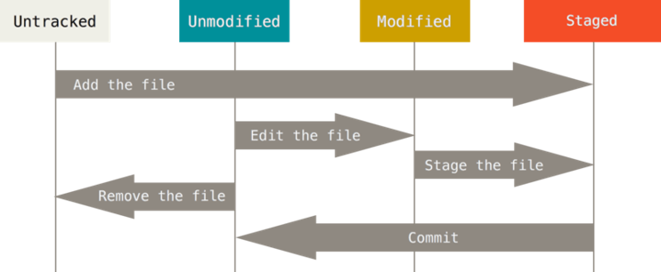

# Johdanto

## Mikä on Git

Versionhallinnan tarkoituksena on tallettaa lähdekoodin versioiden muutoksia siten, että 
- Aikaisemmat versiot voidaan tarvittaessa palauttaa
- Ohjelmistosta voidaan kehittää useita eri versioita yhtaikaa hallitusti.
- Ohjelmistoon tehtyjä muutoksia voidaan seurata, dokumentoida ja hallita. 

Versionhallintajärjestelmiä on useita erilaisia. Niistä Git on muodostunut de-facto standardiksi, sitä käytetään hyvin yleisesti.
Git on 
- Avointa lähdekoodia
- Ilmainen
- Hajautettu, siinä ei siis ole minkäänlaista keskitettyä palvelinta. Jokainen Git-tietovarasto on itsenäinen.

## Repositoryt ja hajautus

Git tallettaa kaiken informaation paikallisesti omaan tietovarastoonsa, jota kutsutaan repositoryksi.

Lähes kaikki toiminnot voidaan tehdä paikallisesti. Voit siis kehittää ja tallettaa versioita ilman verkkoyhteyttä.

Itsenäisten repositoryjen sisältöjä voidaan synkronoida keskenään. Tähän tietysti tarvitaan verkkoyhteys.


## Git:n käyttöönotto

### Asennus

Git-ohjelmisto on oltava asennettuna jokaisella tietokoneella, jolla sitä haluataan käyttää

-  Linux: https://git-scm.com/download/linux
-  Mac:  https://git-scm.com/download/mac
-  Windows: https://git-scm.com/download/win 

Windows-asennus sisältää Git Bash –komentotulkin, joka amuloi linux-järjestelmissä yleisesti käytettyä bash-komentotulkkia (shell)

Git:lle on useita graafisia käyttöliittymiä, myös Windows-asennuspaketissa on yksi sellainen, mutta kurssilla käytämme komentorivikomentoja.  Niin tekevät useimmat ammattilaisetkin.

> Komentorivin käytöstä voisi olla jonkinlainen yhteenveto ja tehtävä tms.

> Eri komentotulkit

> Tässä materiaalissa käytetään mahdollisissa tiedostojärjestelmäkomennoissa bash-komentoja. git-komennot ovat samat kaikilla komentotulkeilla (vai ovatko?).

### Konfigurointi

Jokaiseen talletettuun muutokseen tallentuu käyttäjän nimi ja sähköpostiosoite
Käyttäjätiedot tarvitsee asettaa tietokoneelle vain kerran, ja niitä voi tarvittaessa myöhemmin muuttaa
```
$ git config –-global user.name ”Markku Ruonavaara”
$ git config –-global user.email markku.ruonavaara@haaga-helia.fi
```

Konfigurointitietoja tallennetaan systeemi-, käyttäjä- ja projektikohtaisesti. Tarkennin `-–global` viittaa siihen, että asetus on systeemikohtainen.

Voit halutessasi asettaa editorin, jonka Git toimintojen yhteydessä käynnistää tekstin kirjoittamista varten. Oletusarvoisesti se on systeemin oletuseditori, joka yleensä on vi.

```
$ git config --global core.editor "code --wait"
```

Konfigurointi määrittää käynnistyskomennon, joten jos editoria ei löydy polusta, voit joutua antamaan koko polun. Windows-ympäristössä näin usein on.

Asetukset voit tarkistaa näin:
```
$ git config –-list
```
# Peruskäyttö

## Repositoryn perustaminen

Voit perustaa repositoryn hakemistoon, joka ei ole vielä versionhallinnassa, komennolla init.

```bash
$ mkdir demo 		# luodaan hakemisto
$ cd demo		    # vaihdetaan uusi hakemisto oletushakemistoksi
$ git init
```

Komento luo tyhjän repositoryn, johon voit tallettaa versioita. Tiedot tallentuvat alihakemistoon .git-nimiseen alihakemistoon. 
.git-hakemistosta tunnistat, onko hakemisto Git-versionhallinnassa.

> Miten voit nähdä, mihin tiedot on talletettu?

## Repositoryn perustaminen toisesta reposta

Usein haluat kopioida olemassa olevan repositoryn ja jatkaa työskentelyä siitä. Tämä tapahtuu komennolla clone, esim.

```
$ git clone https://github.com/libgit2/libgit2
```

Komento lisää nykyiseen hakemistoon alihakemiston libgit2, joka sisältää alkuperäisen repositoryn datan kopion (.git) sekä uusimman version tiedostot.

Se myös konfiguroi alkuperäisen repositoryn uuden repositoryn etärepositoryksi, tästä lisää myöhemmin.

## Tiedostot Git-työhakemistossa

Tiedostot voivat olla joko 
-  Tracked – Git:n hallinnassa
-  Untracked – ei Git:ssä

Git:n hallitsema tiedosto voi olla
- Unmodified - sama kuin uusin versio 
- Modified – erilainen kuin uusin versio
- Staged – merkitty otettavaksi seuraavaan committiin




## Tiedoston vienti Git-hallintaan

Jotta voit tallettaa muutoksia, tiedosto on lisättävä repositoryyn.

```bash
$ git add hello.html
```

Voit myös lisätä koko hakemiston, jolloin kaikki hakemiston tiedostot ja alihakemistot sisältöineen lisätään kerralla.

```bash
$ git add .		# . viittaa nykyiseen hakemistoon
```

Työhakemiston tiedostojen Git-tilaa voi tarkastella komennolla status.

```bash
$ git status
```

Nyt tiedostot ovat __tracked__ ja __staged__, valmiita __commit__-toimintoa varten.

> Tämä osio pitää järjestellä uudelleen, esitys on epälooginen

## Muutosten tallettaminen: add

Kun teet muutoksia Git-hallinnassa olevaan tiedostoon, sen tilaksi tulee modified.

Kun tiedosto on valmis talletettavaksi versionhallintaan, muutettu tiedosto on merkittävä otettavaksi mukaan seuraavaan committiin. Tätä kutsutaan Git-terminologiassa nimellä staging, ja se tehdään komennolla add. 

```bash
$ git add .	# merkitse kaikki uudet ja muuttuneet tiedostot mukaan otettaviksi
```

Nyt muuttuneet tiedostot ovat valmiita talletettavaksi versionhallintaan. Kuten huomasit, uuden tiedoston tuominen on muutos siinä kuin olemassa olevankin muuttaminen.

## Muutosten tallettaminen: commit

Varsinainen talletus tapahtuu komennolla commit.

```bash
$ git commit
```

Komento käynnistää editorin, jolla voit kirjoittaa muutokseen talletettavan kommentin. Kun talletat ja suljet, muutos viedään tietovarastoon.

Kirjaa kommenttiin muutoksen aihe selkeästi, ne ovat tärkeää kommunikaatio itsellesi ja projektiryhmällesi.

Voit myös kirjata kommentin komentorivillä ilman editoria:

```bash
$ git commit –m "Lisätty logout-toiminnallisuus"
```
## Muutosten tarkastelu

Näet commit-historian komennolla log.

```bash
$ git log
```

Komento listaa kaikki commitit käänteisessä aikajärjestyksessä.
Työtilan muutoksia verrattuna talletettuihin voit tarkastella tutulla komennolla status

Tiedoston muutoksia aiempaan versioon voi tarkastella komennolla diff.

```bash
$ git diff hello.html
```

> Pitää lisätä selvitys committien tunnisteista ja erilaisista tavoista viitata committeihin. Tuleeko seuraavassa osiossa?
>
> Myös selvitys työtilan toiminnasta, mitä tekee checkout

## Oho! Eiku…

Jos commitista unohtui jotain tai viesti meni väärin, voit täydentää tuoreinta kommittia laajentimella --amend. Lisää (add) muutokset ja tee commit:

```bash
$ git commit --amend
```
> Tätä ei ehkä kannata mainita ainakaan vielä tässä
> 
Jos lisäsit seuraavaan committiin (add) tiedoston, joka ei sinne kuuluisi, voit peruuttaa stagingin komennolla reset.

```bash
$ git reset HEAD temp.log 	# HEAD viittaa tuoreimpaan versioon
```
> Mainitse, että tämä ei tuhoa mitään, vain muuttaa teidoston tilan

Jos haluat hylätä tiedostoon tekemäsi muutokset ja palata versionhallinnassa olevaan versioon, se onnistuu komennolla checkout.

```bash
$ git checkout –- hello.html
```
> Mainitse, että tämä hävittää tehdyt muutokset tiedostosta

Muista, että kaikki, mikä on commitilla talletettu, on palautettavissa. Siksi committeja kannattaa tehdä usein.

> Tästä voi katsoa mallia, jäsentely, eteneminen ja komentojen esitystapa näyttää hyvältä: https://githowto.com/
>
> 

## Yhteenveto

Yhteenveto osion tärkeimmistä sisällöistä

Jokin Moodle-tehtävä?