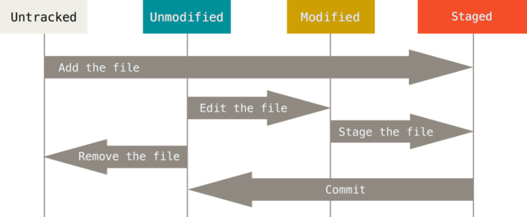

# Peruskäyttö

## Repositorion perustaminen

Voit perustaa repositoryn hakemistoon, joka ei ole vielä versionhallinnassa, komennolla init.

```bash
$ mkdir demo 		# luodaan hakemisto
$ cd demo		    # vaihdetaan uusi hakemisto oletushakemistoksi
$ git init
```

Komento luo tyhjän repositoryn, johon voit tallettaa versioita. Tiedot tallentuvat alihakemistoon .git-nimiseen alihakemistoon. 
.git-hakemistosta tunnistat, onko hakemisto Git-versionhallinnassa.

Tiedostot ja hakemistot, joiden nimi alkaa pisteellä, ovat piilotettuja, niitä ei oletusarvoisesti näytetä. Saat piilotetut hakemistot näkyviin `ls`-komennon laajentimella `-a`. Laajentimella `-l`` näytetään tiedostojen ja hakemistojen kaikki tiedot.

``` bash
$ ls -l -a
total 31
drwxr-xr-x 1 h01975 1049089    0 Feb 15 15:04 ./
drwxr-xr-x 1 h01975 1049089    0 Feb 22 15:08 ../
drwxr-xr-x 1 h01975 1049089    0 Feb 15 15:04 .git/
-rw-r--r-- 1 h01975 1049089   81 Feb 15 12:36 .gitattributes
drwxr-xr-x 1 h01975 1049089    0 Feb 15 12:36 .github/
-rw-r--r-- 1 h01975 1049089  490 Feb 15 12:36 .gitignore
-rw-r--r-- 1 h01975 1049089   13 Feb 15 13:42 hello.txt
-rw-r--r-- 1 h01975 1049089 9305 Feb 15 12:36 readme.md
-rw-r--r-- 1 h01975 1049089   29 Feb 15 15:04 time.txt
```

Jotta piilotetut tiedostot näkyisivät Windowsin tiedostojenhallinnassa, on tiedostojenhallinan asetuksissa määritettävä piilotetut tiedostot näkyviin.

### Repositorion perustaminen toisesta repositoriosta

Usein haluat kopioida olemassa olevan repositoryn ja jatkaa työskentelyä siitä. Tämä tapahtuu komennolla clone, esim.

```
$ git clone https://github.com/libgit2/libgit2
```

Komento lisää nykyiseen hakemistoon alihakemiston libgit2, joka sisältää alkuperäisen repositoryn datan kopion (.git) sekä uusimman version tiedostot. Se myös konfiguroi alkuperäisen repositoryn uuden repositoryn etärepositoryksi. Näistä lisää myöhemmin.

## Tiedostojen talletus Git-hallintaan

Hakemisto, johon on perustettu Git-repositorio, on Git:n __työhakemisto__. Sen tiedostot ja alihakemistot ovat otettavissa Git-hallintaan. Ne pitää erikseen viedä Git-hallintaan, jos niiden versioita halutaan hallinnoida.

Git:n näkökulmasta hakemistossa olevat tiedostot tiedostot voivat olla joko 
-  Tracked – Otettu Git:n hallintaan
-  Untracked – ei Git-hallinnassa

Git:n hallinnassa oleva olevan työhakemiston tiedosto voi olla
- Unmodified - muuttumaton sama kuin talletettu uusin versio 
- Modified – muuttunut, erilainen kuin talletettu uusin versio
- Staged – merkitty otettavaksi seuraavaan talletukseen (_commit_)




Työhakemiston tiedostojen Git-tilaa voi tarkastella komennolla status.

```bash
$ git status
```

### Muutosten tallettaminen, vaihe 1: add

Tiedostoversioiden tallettaminen on kaksivaiheinen operaatio. 

Kun tiedosto on valmis talletettavaksi versionhallintaan, uusi tai muutettu tiedosto on merkittävä otettavaksi mukaan seuraavaan talletukseen (_commit_). Tätä toimintoa kutsutaan Git-terminologiassa nimellä _staging_, ja se tehdään komennolla `add`. 

Tiedostot voidaan lisätä seuraavaan talletukseen yksittäin.

```bash
$ git add hello.html   # tiedosto hello.html otetaan mukaan seuraavaan talletukseen
```
Voit myös lisätä koko hakemiston, jolloin kaikki hakemiston tiedostot ja alihakemistot sisältöineen lisätään kerralla. Hakemistot ovat myös tiedostoja, nekin versioituvat.

```bash
$ git add .		# . viittaa nykyiseen hakemistoon, kaikki uudet ja muuttuneet tiedostot otetaan mukaan
```

Nyt muuttuneet tiedostot ovat valmiita talletettavaksi versionhallintaan. Kuten huomasit, uuden tiedoston tuominen on muutos siinä kuin olemassa olevankin muuttaminen.

Nyt Git on tietoinen, mitä pitää tallentaa, ja ollaan valmiita `commit`-toimintoa varten.

### Muutosten tallettaminen, vaihe 2: commit

Varsinainen talletus tapahtuu komennolla `commit`.

```bash
$ git commit
```

Komento käynnistää editorin, jolla voit kirjoittaa muutokseen talletettavan kommentin. Kun talletat ja suljet, muutos viedään tietovarastoon.

Kirjaa kommenttiin muutoksen aihe selkeästi, ne ovat tärkeää kommunikaatiota itsellesi ja projektiryhmällesi.

Voit myös kirjata kommentin komentorivillä ilman editoria:

```bash
$ git commit –m "Lisätty logout-toiminnallisuus"
```
### Talletusten tarkastelu

Työtilan muutoksia verrattuna talletettuihin voit tarkastella tutulla komennolla `status`. Sitä kannattaa käyttää ahkerasti, jotta pysyt selvillä, mikä on hakemiston ja sen muutosten Git-tila:
```bash
$ git status
```
Näet commit-talletusten historian komennolla `log`.

```bash
$ git log
```

Komento listaa kaikki talletukset käänteisessä aikajärjestyksessä. Laajentimella `--stat` Git lisää tulostukseen lyhyen yhteenvedon talletuksen muutoksista:

```
$ git log --stat
```

Työhakemistossa olevan tiedoston muutoksia verratuuna viimeksi talletettuun versioon voi tarkastella komennolla `diff`.

```bash
$ git diff hello.html
```

### Tiedostojen poistaminen ja siirtäminen

Kuten aiemmin todettiin, hakemistot versioituvat myös. Jos haluat poistaa tiedoston repositoriosta tai siirtää tiedoston toiseen hakemistoon, olet tekemässä uutta versiota hakemistoista. 

Git-komento `rm` poistaa tiedoston paitsi työhakemistosta myös Git-hallinnasta. Muutos on sen lisäksi talletettava versionhallintaan
```bash
$ git rm test.txt
$ git commit -m "Poistettu tarpeeton tiedosto"
```
Huomaa, että vanhat talletetut versiot säilyvät versionhallinnassa! Se, mikä on versionhallintaan talletettu, säilyy siellä.

Git-komennolla `mv` voi nimeätä tiedoston uudelleen tai siirtää toiseen hakemistoon. 

```bash
$ git mv oldname.txt newname.txt
$ mkdir newdir
$ git mv newname.txt newdir
$ git add .
$ git commit -m "Uudelleenjärjestelty tiedostoja"
```

Tiedostoja voi poistaa ja siirtää repositorion sisällä käyttöjärjestelmän komennoilla (esim. `rm` tai `mv`). Muutokset talletetaan Git-hallintaan samalla tapaa kuin mikä tahansa muutos: ensin `add`, sitten `commit`. Vastaavilla Git-komennoilla ei `add`-vaihetta tarvita

## Paluu menneisyyteen

Johdanto-osiossa väitettiin, että versionhallinnan avulla on mahdollista palauttaa ohjelmiston aiempia versioita. Kokeillaa sitä seuraavassa.

Tarkastellaan Git-komennon `log` tulostusta:
```
commit 6fa5fd1b94a163464aaf56a7b69b6f7f4cca429b
Author: Ruonavaara Markku <markku.ruonavaara@haaga-helia.fi>
Date:   Sun Mar 10 15:16:39 2024 +0200

    Lisätty toinen tiedosto

commit 77d8790ada4aa9ce8e438a360e44657334eeb7d3
Author: Ruonavaara Markku <markku.ruonavaara@haaga-helia.fi>
Date:   Sun Mar 10 15:14:41 2024 +0200

    Uudelleenjärjestelty tiedostoja

commit 5d565f66349cb8eb1b3550855d89d12496f23a1b
Author: Ruonavaara Markku <markku.ruonavaara@haaga-helia.fi>
Date:   Sun Mar 10 15:13:46 2024 +0200

    Lisätty tiedosto

commit f78c0a4d638b3c3f3cfb85a2c5e7eba38023d8b3
Author: Ruonavaara Markku <markku.ruonavaara@haaga-helia.fi>
Date:   Sun Mar 10 14:57:53 2024 +0200

    Ensimmäinen commit

```
Git antaa jokaiselle talletukselle (_commit_) yksikäsitteisen tunnistemerkkijonon (esim. _6fa5fd1b94a163464aaf56a7b69b6f7f4cca429b_). Tätä tunnistetta kutsutaan Git-terminologiassa nimellä _hash_.

Kun tiedämme tallennuksen tunnisteen, voimme palata sen tilanteeseen komennolla `checkout`. Palataan ensimmäisen tallennuksen _Ensimmäinen commit_ tilanteeseen: 
```bash
$ git checkout f78c0a4
Note: switching to 'f78c0a4'.

You are in 'detached HEAD' state. You can look around, make experimental
changes and commit them, and you can discard any commits you make in this
state without impacting any branches by switching back to a branch.

If you want to create a new branch to retain commits you create, you may
do so (now or later) by using -c with the switch command. Example:

  git switch -c <new-branch-name>

Or undo this operation with:

  git switch -

Turn off this advice by setting config variable advice.detachedHead to false

HEAD is now at f78c0a4 Ensimmäinen commit
```
Koko tunnistetta ei tarvitse antaa, seitsemän ensimmäistä merkkiä riittää.

Nyt työhakemisto on päivittynyt ensimmäisen commit-tallennuksen tilanteeseen, ja hakemistossa on vain sinne ensimmäisenä tehty tiedosto `text.txt`.

```
$ ls -l -a
total 13
drwxr-xr-x 1 h01975 1049089  0 Mar 10 16:17 ./
drwxr-xr-x 1 h01975 1049089  0 Mar 10 13:49 ../
drwxr-xr-x 1 h01975 1049089  0 Mar 10 16:20 .git/
-rw-r--r-- 1 h01975 1049089 17 Mar 10 15:00 test.txt

```

Komennon ilmoitus kertoo, että olemme _detached HEAD_-tilassa. Se tarkoittaa, että jos teemme muutoksia, ne eivät tule tallettumaan mihinkään _haaraan_, jolloin ne eivät näkyisi versiohistoriassa. Käytännössä tässä tilassa ei kannata tallettaa muutoksia. 

Takaisin nykytilaan päästään esimerkiksi Git:n antaman neuvon mukaisesti:

```bash
git switch -     # palataan siihen haaraan, josta checkout tehtiin
```

Siihen, mistä tässä on kyse ja miten kannattaa toimia, palataan myöhemmin. 


## Oho! Eiku…

Versionhallintatoimintojen kanssa voi helposti tulla erehdyksiä. Hätä ei kuitenkaan ole tämännäköinen, kaikki on oikaistavissa. Tässä joitakin peruutusohjeita.

### `add`-komennon peruuttaminen

Jos lisäsit seuraavaan talletukseen tiedoston, joka ei sinne kuuluisi, voit peruuttaa lisäyksen komennolla `reset`.

```bash
$ git reset temp.log
```

Jos et anna parametria, kaikki lisätyt tiedostot poistetaan seuraavasta tallennuksesta.

Komento ei poista tiedostoja, vain muuttaa tiedoston tilan talletuksen suhteen.

### Työtilaan tehtyjen muutosten peruuttaminen ennen talletusta

Jos haluat peruuttaa tiedostoon työtilassa tekemäsi muutokset, joita ei ole talletettu versionhallintaan (_commit_), voit palauttaa tiedoston versionhallinnan tuoreimman version tasalle komennolla `restore`:

```bash
git restore hello.html
```

Huomaa, että tässä tapauksessa tekemästi muutokset häviävät eivätkä ne ole palautettavissa. Vain talletetut versiot ovat palautettavissa.

Jos haluat peruuttaa kaikki työtilaan tekemäsi muutokset, se onnistuu komennolla `git reset`.

### Tallennettujen muutosten peruminen

Jos olet tallentanut muutoksen versionhallintaan, muutokselle on jo luotu tunniste ja siitä on talletettu kaikki tiedot. Jos sitä muutettaisiin, jouduttaisin peukaloimaan historiaa.

Muutoksen poistaminen ei oikeastaan ole edes järkevää. Sen sijaan että yrittäisit muuttaa historiaa, voit tehdä uuden muutoksen, jossa väärä muutos korjataan. 

Yksi ylimääräinen talletus ei haittaa, ja korjaus on täysin riskitön. Sen sijaan historian muuttaminen olisi riskialtista, se voisi aiheuttaa monin verroin suurempia ongelmia kuin ylimääräinen talletus.

Voit peruuttaa kokonaisen talletuksen tekemällä "anti-talletuksen" Git-komennolla `revert`. Komento tekee muutoksen, joka peruuttaa sille parametrina annetun talletuksen kokonaan.

```bash
$ git log -2      # näyttää kaksi viimeisintä talletusta
commit 4a731586b83b6c1469416a489e5da1a4560707d4 (HEAD -> master)
Author: Ruonavaara Markku <markku.ruonavaara@haaga-helia.fi>
Date:   Sun Mar 10 16:58:47 2024 +0200

    Lisätty log-tiedosto

commit 21f29c9814e6f101319edc51a199b2d62eb97fae
Author: Ruonavaara Markku <markku.ruonavaara@haaga-helia.fi>
Date:   Sun Mar 10 15:19:32 2024 +0200

    Siirrelty taas tiedostoja

$ git revert 4a73158
[master 83e809b] Revert "Lisätty log-tiedosto"
 1 file changed, 53 deletions(-)
 delete mode 100644 log.txt

$ git log -2
commit 83e809b0dd28076a423d916229567e61f8f44043 (HEAD -> master)
Author: Ruonavaara Markku <markku.ruonavaara@haaga-helia.fi>
Date:   Sun Mar 10 16:59:26 2024 +0200

    Revert "Lisätty log-tiedosto"

    This reverts commit 4a731586b83b6c1469416a489e5da1a4560707d4.

commit 4a731586b83b6c1469416a489e5da1a4560707d4
Author: Ruonavaara Markku <markku.ruonavaara@haaga-helia.fi>
Date:   Sun Mar 10 16:58:47 2024 +0200

    Lisätty log-tiedosto

```
Komento `revert` peruuttaa yhden talletuksen kerrallaan. Jos haluat peruuttaa useampia talletuksia, jokainen pitää peruuttaa yksi kerrallaan.

Muista, että __kaikki, mikä on versionhallintaan talletettu, on palautettavissa__. Siksi commit-talletuksia kannattaa tehdä usein.

## Yhteenveto

Yhteenveto osion tärkeimmistä sisällöistä

Jokin Moodle-tehtävä?


> __Harjoitus__
>
> 1. Tee koneellesi kurssin harjoituksia varten hakemisto ja perusta sinne Git-repositorio.
> 
> 2. Tee repositorioon tiedosto (esim. `test.txt`) ja kirjoita tiedostoon jotain.
> 
> 3. Talleta tiedosto Git-hallintaan. Laadi talletuksellesi kuvaava kommenttiviesti.
>
> 4. Tee repositorioon hakemisto `hello` ja sinne tiedosto `hello.html`. Tiedoston sisältö voi olla esim.
> ```
> Hello World!
> ```
> 5. Vie nämä muutokset Git-hallintaan. Laadi talletuksellesi kuvaava kommenttiviesti.
> 
> 6. Ensimmäisenä luotu text.txt-tiedosto on nyt käynyt tarpeettomaksi. Poista se versionhallinnasta. Laadi talletuksellesi kuvaava kommenttiviesti.
>
> 7. Voit kokeeksi tehdä muitakin muutoksia ja tallettaa niitä versionhallintaan. Lopuksi kopioi komennon `git log --stat` tulostus tiedostoon `log.txt` ja talleta se repositoriosi päätasolle.
>
> __Vinkkejä__
> - Työhakemiston sisältöä (`ls`) ja sen git-tilaa (komento `status`) kannattaa tarkastella Git-operaatiota ennen ja niiden jälkeen. 
> - Git neuvoo sinua aina, kun teet jonkin toimenpiteen. Ilmoituksia kannattaa lukea ja yrittää tulkita. 
> - Voit ohjata komentorivillä komennon tulostuksen suoraan tiedostoon näin: `git log --stat > log.txt`
